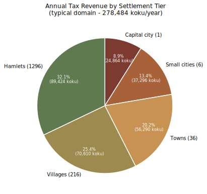

# Domain Budgets

Per-tier budget breakdowns for the median domain hierarchy, plus supporting tables.

## Contents

- [What These Populations Count](#what-these-populations-count)
- [What the Samurai Counts Mean](#what-the-samurai-counts-mean)
- [Samurai Stipend Convention](#samurai-stipend-convention)
- [The Two Empire-Wide Multipliers](#the-two-empire-wide-multipliers)
- [Domain](#domain)
  - [Samurai](#samurai)
  - [Budget](#budget)
  - [Combined Budgets](#combined-budgets)
- [Province](#province)
  - [Samurai](#samurai-1)
  - [Budget](#budget-1)
  - [Tax Farming Cost by Tier](#tax-farming-cost-by-tier)
- [County](#county)
  - [Samurai](#samurai-2)
  - [Skilled Ashigaru](#skilled-ashigaru)
  - [Ashigaru](#ashigaru)
  - [Budget](#budget-2)
- [Ministry Budgets](#ministry-budgets)
  - [Domain Ministry Budgets](#domain-ministry-budgets)
  - [Provincial Ministry Budgets](#provincial-ministry-budgets)
  - [Cross-cutting project negotiation](#cross-cutting-project-negotiation)
- [Example Office-Holder Budgets](#example-office-holder-budgets)
  - [Magistrate Hida no Reiji Hikai of Seitoyama County](#magistrate-hida-no-reiji-hikai-of-seitoyama-county)
    - [Income](#income)
    - [Mandatory expenses](#mandatory-expenses)
    - [Gift income (in addition to tax revenue)](#gift-income-in-addition-to-tax-revenue)
    - [Discretionary residual](#discretionary-residual)
    - [Hikai's discretionary breakdown](#hikais-discretionary-breakdown)
    - [Summary](#summary)
  - [Governor Hida no Reiji Asuka of Nagahara Province](#governor-hida-no-reiji-asuka-of-nagahara-province)
    - [Income](#income-1)
    - [Mandatory expenses](#mandatory-expenses-1)
    - [Gift income](#gift-income)
    - [Discretionary residual](#discretionary-residual-1)
    - [Asuka's discretionary breakdown](#asukas-discretionary-breakdown)
    - [Summary](#summary-1)
  - [Daimyo Hida no Reiji Isao of the Reiji Domain](#daimyo-hida-no-reiji-isao-of-the-reiji-domain)
    - [Income](#income-2)
    - [Mandatory expenses](#mandatory-expenses-2)
    - [Gift income](#gift-income-1)
    - [Discretionary residual](#discretionary-residual-2)
    - [Isao's discretionary breakdown](#isaos-discretionary-breakdown)
    - [Summary](#summary-2)
- [The Imperial Budget](#the-imperial-budget)
  - [Imperial Revenue](#imperial-revenue-36-42-million-koku-per-year-at-canonical-baseline)
  - [Imperial Spending](#imperial-spending-26-40-million-koku-per-year)
  - [Imperial Budget Scale: Historical Context](#imperial-budget-scale-historical-context)
  - [Imperial Roads and Waystations: Line-Item Detail](#imperial-roads-and-waystations-line-item-detail)
  - [Imperial Roads: a Special Case](#imperial-roads-a-special-case)
  - [Imperial Legions: Line-Item Detail](#imperial-legions-line-item-detail)
  - [Kaiu Wall Direct Contributions: Line-Item Detail](#kaiu-wall-direct-contributions-line-item-detail)
  - [Imperial Magistrates and Their Staff: Line-Item Detail](#imperial-magistrates-and-their-staff-line-item-detail)
  - [Imperial Savings: the "Wealth in Favors Owed" Model](#imperial-savings-the-wealth-in-favors-owed-model)
- [Capital City](#capital-city)
- [Provincial City](#provincial-city)
- [Town](#town)
- [Village](#village)
- [Hamlet](#hamlet)
- [Tax Pie](#tax-pie)
- [Land Productivity](#land-productivity)
  - [Unit Conversions: land area to rice koku](#unit-conversions-land-area-to-rice-koku)
  - [Per-Family Reference](#per-family-reference)
  - [Farm Families by Tier (per Domain)](#farm-families-by-tier-per-domain)
  - [Arable Land Allocation (per Domain)](#arable-land-allocation-per-domain)
  - [Rice Productivity by Land Quality](#rice-productivity-by-land-quality)
  - [Wheat Productivity by Land Quality](#wheat-productivity-by-land-quality)

## What These Populations Count

The "population" figures in this document mean different things at different tiers, and the differences matter for the math downstream (see [`l7r.md` - The Median Domain](l7r.md#the-median-domain) for the canonical per-tier population ranges):

- **Hamlet (~50-100, average ~75) and Village (~200-500, average ~350)**: counts every person living in that settlement.  These are pure farming communities - a hamlet is just a cluster of farmhouses; a village is several clusters around multiple large fields plus a slightly larger headman's household.  No burakumin in most rural settlements, as burakumin live in towns and cities where their specialty trades have customers.
- **Town (~900-1,500, average ~1,200)**: counts the in-and-around population.  Most town residents are farmers (~65%) because the working farmland immediately surrounding a county town is included in the town's population.  Border towns tend to be walled, whereas towns which do not need to maintain this level of military preparedness have a much more porous boundary and lack a clear inside-vs-outside boundary.  A "county" is the town plus its surrounding village districts.
- **Provincial city (~2,000-4,000, average ~3,000) and Capital city (~12,000)**: counts ONLY the population living within the city walls / on the city's footprint proper.  Cities are nearly always built on top of (or beside) very fertile land, and that land is farmed - but the farmers who work it live in villages and hamlets in the *surrounding county*, not in the city itself, which will almost always be walled and thus have rigorous demarcation between their urban interior and agricultural exterior.  That is why both city tiers show zero farmers in their caste tables.

The practical result: a capital city of ~12,000 is a city of ~12,000 administrators / artisans / soldiers / merchants / servants, ringed by farming villages whose inhabitants are counted under the surrounding rural settlement totals.  Likewise the ~6 provincial cities of a domain - each ~2,000-4,000 inside the walls, surrounded by farming villages counted in other population totals.

## What the Samurai Counts Mean

The samurai populations in the per-tier sub-tables (~1,000 in the capital, ~250 per provincial city, ~15 per county town, for a per-domain total of ~3,000) refer specifically to the **useful working cohort**: samurai past their gempukku and not yet retired.  The total samurai population per domain, including children and retirees living in their family households, is approximately **5,000** (per [`l7r.md` - The Median Domain](l7r.md#the-median-domain)).  The 60% useful figure replaces an older 80% estimate; earlier versions of these tables showed ~4,000 working samurai under that older rule.  Children and retirees consume from their family's resources rather than from a separate government allocation, so they do not appear as line items in these budgets.

## Samurai Stipend Convention

The Stipend column in the per-tier Samurai sub-tables shows the mean **average** annual stipend per working samurai at each tier.  Individual stipends follow the rank-squared rule (`stipend = rank^2`, per [`l7r.md` - Accordances of Rank](l7r.md#accordances-of-rank)): a Rank 1 bushi receives 1 koku, a Rank 5 county magistrate receives 25 koku, a Rank 10 minister 100 koku, a Rank 12 daimyo 144 koku.

The average varies by tier because the rank distribution does:

- **County town samurai**: ~10 koku average (avg rank ~3).  A typical county town's 15 samurai include 1 magistrate (Rank 5, 25 koku), the magistrate's karo and ~3 squad sergeants (Rank 4, 16 koku each), ~3 squad corporals (Rank 3, 9 koku each), and the remainder mostly Rank 2-3 bushi.
- **Provincial city samurai**: ~15 koku average (avg rank ~3-4).  Provincial cities house the provincial governor (Rank 8), six provincial ministers (Rank 7) and their deputies (Rank 6), mid-rank clerks (Rank 3-5), and rank-and-file bushi assigned to provincial administrative and military duties.
- **Capital city samurai**: ~35 koku average (avg rank ~5-6).  The capital is staffed with the senior cohort - the daimyo (Rank 12), councilors (Rank 11), domain ministers (Rank 10) and their deputies (Rank 9), high-rank clerks (Rank 7-8), castle guards and household retainers from the daimyo's elite retinue, and junior officials in training for higher posts.  Low-rank samurai compose a lower proportion of retainers in the capital than in the provinces.

**Stipends are paid out of the broader tax-farming allocation at the tier where the samurai serves** (NOT out of the discretionary "tax-farming cut" that defines the post's value): capital samurai stipends are funded by the daimyo's broader allocation as a separate ~40,000-koku mandatory line; provincial samurai stipends by the governor's broader allocation as a separate ~5,000-koku mandatory line; county samurai stipends as part of the magistrate's mandatory expenses.  The ~1,000 / ~10,000 / variable canonical "cuts" at the magistrate / governor / daimyo tiers are the discretionary income remaining after all mandatory expenses (tax obligations up, stipends, ministry overhead, kick-ups, etc.) - not the working budget out of which everything is paid.  Cross-tier flow does not happen for stipends as it does for gifts and lineage finances - a provincial samurai is paid by their governor regardless of which lineage the samurai or governor belongs to (see [`l7r.md` - Samurai Lineages](l7r.md#samurai-lineages) for the discussion of how lineage politics and fiscal flow interact).

## The Two Empire-Wide Multipliers

Empire-wide aggregations in this document use one of **two different multipliers** depending on what type of quantity is being aggregated.  Both are correct in their respective contexts; choosing the wrong one is the most common source of arithmetic confusion in the budget math.

| Multiplier | Value | Used For |
| --- | --- | --- |
| **Actual-domain multiplier** | **~284** | Quantities that exist exactly once per daimyo: capital cities, Imperial Magistrate main offices (one per the Emerald Charter), daimyo discretionary cuts, total working samurai pool per domain (~3,000 each), domain-level tax throughput, domain-level kick-up aggregations |
| **Median-size-equivalent (ME) multiplier** | **~400** | Sub-unit counts and geographic distributions that scale with land area: provincial cities (× 6 per ME = ~2,400), towns (× 36 per ME = ~14,400), villages (× 216 per ME = ~86,400), hamlets (× 1,296 per ME = ~518,400), counties (× 36 per ME = ~14,400), waystations (~12.5 per ME = ~5,000), Imperial road mileage (~125 per ME = ~50,000 miles), and Yasuki Taka tariff collection points (one per provincial city + one per capital, ~2,684 Empire-wide) |

The reason there are two multipliers is a structural feature of the Empire's geography and political organization.  Each Great Clan and family carves up its territory into ~284 administrative domains headed by daimyo.  These domains vary substantially in size: the smallest (frontier vassal-house holdings, lean Phoenix mountain territories) are well under 1 ME of land; the largest (clan capitals, major family seats, Yasuki coastal trade hubs) can be 5-10 MEs or more.  The average actual domain has **~1.41 MEs of land** (Empire total area ÷ 284 = 1.41 ME per actual), but each domain still has exactly **1 capital city** and **1 IM main office**.  So per-actual-domain counts for whole-domain quantities do not match per-ME counts for sub-units.

The numerical ratio between the two multipliers is exactly **400 / 284 = 1.41 ME per actual median domain**, which is the same as saying the average actual domain has 1.41 MEs of land area.

### Why "Median Domain" Means Two Things in This Document

The worked examples in this document (Magistrate Hikai's county, Governor Asuka's province, **Daimyo Isao's Reiji domain**) treat Reiji as a **hybrid "median" domain** that uses whichever multiplier produces clean worked-example numbers:

- **As a "median ME"** (sub-unit and geographic counts): Reiji has 6 provincial cities, 36 towns, 216 villages, 1,296 hamlets, ~12 waystations, ~125 miles of Imperial road.  Multiply each of these by **~400 ME** to reach Empire-wide totals.
- **As a "median actual domain"** (whole-domain quantities): Reiji has 1 capital city, 1 IM main office, ~3,000 working samurai (capital cohort + provincial cohorts + town cohorts combined), ~30,000 koku discretionary daimyo cut.  Multiply each of these by **~284 actual domains** to reach Empire-wide totals.

The hybrid framing is intentional and lets worked examples use clean integer counts (6 provincial cities reads more naturally than the strict per-actual-domain 8.45), while still producing correct Empire-wide aggregations as long as the right multiplier is applied to each line.

### The Most Common Mistake

The most common arithmetic mistake is **multiplying a sub-unit count by 284 instead of 400** (e.g., "6 provincial cities × 284 = 1,704" - this undercounts the actual ~2,400 provincial cities Empire-wide because it does not account for larger actual domains having proportionally more provincial cities than the median).  The converse mistake - multiplying a whole-domain quantity by 400 - overshoots Empire-wide totals (e.g., "1 capital city × 400 = 400" overcounts the actual ~284 capital cities Empire-wide).

**The diagnostic question** to ask before multiplying any per-Reiji quantity by an Empire-wide divisor: *Does this quantity scale with the number of daimyo (× 284) or with the land area (× 400)?*  Whole-domain political and administrative quantities use 284; geographic distributions and sub-unit counts use 400.

## Domain

| Place | N | T | P | Total Tax | Total Pop |
| --- | --- | --- | --- | --- | --- |
| Capital city | 1 | 24888 | 12000 | 24888 | 12000 |
| Provincial city | 6 | 6222 | 3000 | 37332 | 18000 |
| Town | 36 | 1603.2 | 1200 | 57715 | 43200 |
| Village | 216 | 350 | 350 | 75600 | 75600 |
| Hamlet | 1296 | 75 | 75 | 97200 | 97200 |
| **Total** |  |  |  | 292735 | 246000 |

### Samurai

| Place | N | P | Stipend | Food | Housing | Equipment | Other | Population | Payroll | Total Food | Total Housing | Total Equipment | Total Cost |
| --- | --- | --- | --- | --- | --- | --- | --- | --- | --- | --- | --- | --- | --- |
| Capital city | 1 | 1000 | 35 | 3 | 0 | 2 | 0 | 1000 | 35000 | 3000 | 0 | 2000 | 40000 |
| Provincial city | 0 | 250 | 15 | 3 | 0 | 2 | 0 | 0 | 0 | 0 | 0 | 0 | 0 |
| Town | 0 | 0 | 10 | 3 | 0 | 2 | 0 | 0 | 0 | 0 | 0 | 0 | 0 |
| Village | 0 | 0 | 10 | 3 | 0 | 2 | 0 | 0 | 0 | 0 | 0 | 0 | 0 |
| Hamlet | 0 | 0 | 10 | 3 | 0 | 2 | 0 | 0 | 0 | 0 | 0 | 0 | 0 |
| **Total** |  |  |  |  |  |  |  | 1000 | 35000 | 3000 | 0 | 2000 | 40000 |

### Budget

| Category | Expense |
| --- | --- |
| Staff | 1000 |
| Samurai | 40000 |
| Ashigaru | 0 |
| Servants | 240 |
| Supplies | 120 |
| **Total** | 41360 |

### Combined Budgets

| Tier | N | Cost (mandatory ops) | Tax Farming (discretionary cut) | Kick-ups Out (to clan/family/Imperial) | Total per Tier |
| --- | --- | --- | --- | --- | --- |
| Domain | 1 | 91,400 | 30,000 | 144,500 | 265,900 |
| Province | 6 | 10,030 | 10,000 | 0 | 120,180 |
| County | 36 | 445 | 1,000 | 0 | 52,020 |
| **Total per median domain** |  |  |  | **144,500** | **438,100** |

Column definitions:

- **Cost (mandatory ops)** at each tier covers samurai compensation, ministry overhead (where applicable), servants, supplies, and miscellaneous operations.  At the domain tier: ~40,000 capital samurai stipends + food + equipment + ~50,000 domain ministry overhead + ~1,400 staff/servants/supplies.  At the province tier: ~5,000 provincial samurai compensation + ~5,000 provincial ministry overhead + ~30 servants/supplies.  At the county tier: ~225 samurai + ~190 ashigaru + ~30 servants/supplies; counties have no ministry overhead because the magistrate IS the institution.
- **Tax Farming (discretionary cut)** is the office-holder's discretionary income at that tier.  The county magistrate's ~1,000 and the provincial governor's ~10,000 are tightly load-bearing canonical figures across the campaign.  The domain daimyo's ~30,000 typical figure is a rough median; actual daimyo cuts range from ~15,000 (poor frontier domains) to ~80,000+ (wealthy clan capitals), with structural factors like Hida-vassal status (~46,000 for the Reiji example documented above) creating additional variation.
- **Kick-ups Out** are funds that flow OUT of the domain to family, clan, and Imperial recipients per the structural kick-up chain (see [The Ministry of Revenue](l7r.md#the-ministry-of-revenue) for the rate structure).  Only the domain tier pays kick-ups directly; counties and provinces pass their tax obligations upward through the cascade rather than paying kick-ups themselves.  The ~144,500 kick-up at the domain tier is composed of ~77,500 (10% of land output, against ~775,000 koku of gross agricultural production per actual median domain) + ~67,000 (10% of imported-goods trade volume per actual median domain; the empire-wide average is higher than the inland Reiji example's ~54,500 because coastal trade-hub domains pull the average up), reflecting the standard non-Hida-vassal rates.
- **Total per Tier** is the sum of mandatory operations, discretionary cuts, and kick-ups across N instances of that tier within a median domain.

**Empire-wide implications**: this table represents a typical actual median domain.  Aggregating by ~284 actual domains in the Empire:

- Total throughput across the Empire: ~124 million koku/year (~438,100 per median × 284 actual domains)
- Kick-ups out of domains, aggregated: ~41 million koku/year, of which ~20.5M lands at the Imperial center (5% land-output kick-up + 5% tariff kick-up per the [Imperial Budget](#the-imperial-budget) framing) and ~20.5M flows to family and clan daimyo
- Stays within domains (operations + discretionary across all tiers): ~83 million koku/year

Two different empire-wide multipliers are in use across the documentation, both correct in their respective contexts: **~284 actual domains** for whole-domain quantities (capital revenue, daimyo cuts, land-output aggregations - matching this table's per-median scale), and **~400 median-size-equivalents × 6 = ~2,400 provincial cities** for sub-unit counts (provinces, counties, tariff collection points - because larger actual domains have proportionally more sub-units than the median).  The [Imperial Budget](#the-imperial-budget) figures below use whichever multiplier is appropriate for each line.

The empire-wide figures align with the [Imperial Budget](#the-imperial-budget) breakdown below, where the Imperial Court's annual revenue derives primarily from ~20.5M of cross-domain kick-ups (land + tariff combined) plus direct Imperial-demesne revenue (Otosan Uchi tax base + tariffs, Imperial-family land taxes, salt monopoly cuts, and miscellaneous mining royalties).

## Province

| Place | N | T | P | Total Tax | Total Pop |
| --- | --- | --- | --- | --- | --- |
| Capital city | 0 | 24888 | 12000 | 0 | 0 |
| Provincial city | 1 | 6222 | 3000 | 6222 | 3000 |
| Town | 6 | 1603.2 | 1200 | 9619 | 7200 |
| Village | 36 | 350 | 350 | 12600 | 12600 |
| Hamlet | 216 | 75 | 75 | 16200 | 16200 |
| **Total** |  |  |  | 44641 | 39000 |

### Samurai

| Place | N | P | Stipend | Food | Housing | Equipment | Other | Population | Payroll | Total Food | Total Housing | Total Equipment | Total Cost |
| --- | --- | --- | --- | --- | --- | --- | --- | --- | --- | --- | --- | --- | --- |
| Capital city | 0 | 1000 | 35 | 3 | 0 | 2 | 0 | 0 | 0 | 0 | 0 | 0 | 0 |
| Provincial city | 1 | 250 | 15 | 3 | 0 | 2 | 0 | 250 | 3750 | 750 | 0 | 500 | 5000 |
| Town | 0 | 15 | 10 | 3 | 0 | 2 | 0 | 0 | 0 | 0 | 0 | 0 | 0 |
| Village | 0 | 0 | 10 | 3 | 0 | 2 | 0 | 0 | 0 | 0 | 0 | 0 | 0 |
| Hamlet | 0 | 0 | 10 | 3 | 0 | 2 | 0 | 0 | 0 | 0 | 0 | 0 | 0 |
| **Total** |  |  |  |  |  |  |  | 250 | 3750 | 750 | 0 | 500 | 5000 |

### Budget

| Category | Expense |
| --- | --- |
| Staff | 0 |
| Samurai | 5000 |
| Ashigaru | 0 |
| Servants | 20 |
| Supplies | 10 |
| Tax Farming | 10000 |
| Total | 15030 |
| Remainder | 29611 |

### Tax Farming Cost by Tier

| N | C | Total |
| --- | --- | --- |
| 36 | 1000 | 36000 |
| 6 | 10000 | 60000 |
| 1 | 100000 | 100000 |

## County

| Place | N | T | P | Total Tax | Total Pop |
| --- | --- | --- | --- | --- | --- |
| Capital city | 0 | 24888 | 12000 | 0 | 0 |
| Provincial city | 0 | 6222 | 3000 | 0 | 0 |
| Town | 1 | 1603.2 | 1200 | 1603 | 1200 |
| Village | 6 | 350 | 350 | 2100 | 2100 |
| Hamlet | 36 | 75 | 75 | 2700 | 2700 |
| **Total** |  |  |  | 6403 | 6000 |

### Samurai

| Place | N | P | Stipend | Food | Housing | Equipment | Other | Population | Payroll | Total Food | Total Housing | Total Equipment | Total Cost |
| --- | --- | --- | --- | --- | --- | --- | --- | --- | --- | --- | --- | --- | --- |
| Capital city | 0 | 1000 | 35 | 3 | 0 | 2 | 0 | 0 | 0 | 0 | 0 | 0 | 0 |
| Provincial city | 0 | 250 | 15 | 3 | 0 | 2 | 0 | 0 | 0 | 0 | 0 | 0 | 0 |
| Town | 1 | 15 | 10 | 3 | 0 | 2 | 0 | 15 | 150 | 45 | 0 | 30 | 225 |
| Village | 6 | 0 | 10 | 3 | 0 | 2 | 0 | 0 | 0 | 0 | 0 | 0 | 0 |
| Hamlet | 36 | 0 | 10 | 3 | 0 | 2 | 0 | 0 | 0 | 0 | 0 | 0 | 0 |
| **Total** |  |  |  |  |  |  |  | 15 | 150 | 45 | 0 | 30 | 225 |

### Skilled Ashigaru

| Place | N | P | Rate | Stipend | Population | Payroll |
| --- | --- | --- | --- | --- | --- | --- |
| Capital city | 0 | 0 | 0.02 | 2 | 0 | 0 |
| Provincial city | 0 | 0 | 0.02 | 2 | 0 | 0 |
| Town | 1 | 0 | 0.02 | 2 | 0 | 0 |
| Village | 6 | 6.93 | 0.02 | 2 | 42 | 83 |
| Hamlet | 36 | 1.49 | 0.02 | 2 | 53 | 107 |
| **Total** |  |  |  |  | 95 | 190 |

### Ashigaru

| Place | N | P | Rate | Population |
| --- | --- | --- | --- | --- |
| Capital city | 0 | 0 | 0.1 | 0 |
| Provincial city | 0 | 0 | 0.1 | 0 |
| Town | 1 | 0 | 0.1 | 0 |
| Village | 6 | 31.5 | 0.1 | 189 |
| Hamlet | 36 | 6.75 | 0.1 | 243 |
| **Total** |  |  |  | 432 |

### Budget

| Category | Expense |
| --- | --- |
| Staff | 0 |
| Samurai | 225 |
| Ashigaru | 190 |
| Servants | 20 |
| Supplies | 10 |
| Tax Farming | 1000 |
| Total | 1445 |
| Remainder | 4958 |

## Ministry Budgets

**Note on the term "tax farming"**: This document uses "tax farming" in its loose modern English sense - the structural pattern of officials keeping a share of taxes they collect as their compensation.  Strictly, tax farming refers to the Roman *publicani* model where collection rights were auctioned to private contractors who paid the state a fixed sum upfront and pocketed whatever they could extract above it.  The Rokugan system isn't that: Rokugani officials are appointed through the civil-service examination and chancellery selection process, not auctioned, and the size of each office's cut is fixed by tradition rather than competitive bidding.  Structurally, the Rokugan arrangement is closer to the Tokugawa *chigyō* (fief grant) or the medieval European prebend (office-attached income), where the official is a state official whose compensation is an attached tax allocation.  "Tax farming" is used here because it conveys the right intuition (the office-holder profits from extraction efficiency) and is the established casual English usage for this broader pattern, including in modern descriptions of the Mughal *jagir* and Ottoman *timar* systems which were similarly appointment-based rather than auctioned.

The Tax Farming line items in the Budget tables (~30,000 typical for the daimyo, ~10,000 per provincial governor, ~1,000 per county magistrate) are **the office-holder's discretionary income** - what remains after all mandatory expenses (tax obligations up to the next tier, kick-ups to clan/family/Imperial, samurai stipends, ministry overhead budgets, manor and office operations).  This is the canonical "tax-farming cut" figure that defines the post's value.  The county magistrate and provincial governor figures are tightly load-bearing across the campaign; the daimyo figure represents a typical median and varies widely (~15,000 for poor frontier domains, ~80,000+ for wealthy clan capitals, with structural factors like Hida-vassal status adding additional variation - see [Domain Ministry Budgets](#domain-ministry-budgets) for the full breakdown).

The breakdowns below show the typical allocation at each tier.  Numbers are approximate and vary by domain, province, and the personalities and politics of the office-holders.  The **informal income** column shows the office-holder's effective personal take above their formal stipend, calculated as a ~10% skim on the ministry budget they administer ("a tithe", a customary rate built into many Rokugani fiscal formalities, e.g. the 10-koku Imperial registration fee on a 100-koku bounty).  Strictly speaking, this is not built into the budget, and in fact office holders are expected to pay all expenses related to their duties even if those expenses exceed their income.  As with tax farming, the presumption is that forward-thinking appointees will save their money in years of plenty so that they can spend their savings and/or make use of lineage reserves as needed in lean years as needed.  The 10% figure is thus only a loose average, and corrupt officials may extract more, while scruplulous samurai might consistently draw on family connections to make up chronic shortfalls without ever personally enriching themselves.

### Domain Ministry Budgets

A typical domain generates ~250,000 koku/year in tax throughput at the daimyo's tier (the six provincial governors' tax obligations passed up + the capital city's direct tax base and import tariffs + domain-level revenue from mining royalties, large cross-province sake export licenses, craft monopolies, and special assessments).  Of this, ~77,500 koku flows up to the clan daimyo, family daimyo, and Imperial superiors as the 10% land-output kick-ups (see [The Imperial Budget](#the-imperial-budget) below); ~54,500 flows up to those same superiors as the 10% tariff kick-ups on the domain's typical ~545,000 koku of imported-goods sales volume (per the Yasuki Taka rate structure documented in [l7r.md - The Ministry of Revenue](l7r.md#the-ministry-of-revenue)); ~40,000 funds the broader cohort of ~1,000 working capital samurai (stipends + food + equipment); ~50,000 funds the six domain ministries' **overhead budgets** (materials, contracts, ministry-specific staff, ministers' formal stipends and customary skims); ~1,400 covers minor domain servants, supplies, and the daimyo's direct administrative staff.  The remaining ~30,000 koku is the **daimyo's discretionary cut** - the daimyo's "tax-farming cut," significantly higher than a provincial governor's ~10,000 and a county magistrate's ~1,000 but not by a fixed ratio.

**Note**: as at the provincial tier, the ministry budgets shown here are **overhead only** - they do NOT include capital samurai stipends, which are funded as a separate ~40,000-koku line from the daimyo's overall budget.  The Ministry of Retainers *administers* stipend disbursement (rice/coin denomination decisions, rank-squared calculations, payment-day logistics) but the funds themselves flow from the daimyo's tax-farming allocation, not from the Retainers ministry's ~3,000-koku overhead budget.  Only working samurai past their gempukku and not yet retired receive stipends.

Unlike the magistrate's ~1,000 and governor's ~10,000 cuts (which are tightly load-bearing canonical figures), the daimyo's discretionary cut varies widely with domain wealth and structural factors.  Wealthy maritime trade domains or large clan-capital domains can run substantially higher (large trade volume, lower per-domain kick-up rates if structurally consolidated); frontier or war-recovering domains run lower (smaller trade base, additional military pressure on the budget).  Hida vassal houses like the Reiji save ~10,900 koku/year on tariff kick-ups and ~15,500 koku/year on land kick-ups (2% layer absorbed in each case), landing them higher than the typical median.  The ~30,000-koku figure for a typical domain represents a rough median, not a fixed expectation; actual daimyo discretionary across the empire ranges from ~15,000 (poor frontier domains) to ~80,000+ (wealthy clan capitals).

The ~50,000-koku ministry overhead allocation breaks down across the six ministries, with effective income for each Rank 10 minister:

| Ministry | Budget | Minister's stipend | Informal income (~10% skim + throughput where applicable) | Minister's effective income |
| --- | --- | --- | --- | --- |
| Works | ~30,000 | 100 | ~3,000 | **~3,100** |
| War | ~7,000 | 100 | ~700 | **~800** |
| Rites | ~6,000 | 100 | ~600 | **~700** |
| Justice | ~3,000 | 100 | ~300 (formal) + variable from gifts and fines | **~400 (virtuous) to ~3,000+ (corrupt in a wealthy domain)** |
| Retainers | ~3,000 | 100 | ~300 (formal) + ~2,000 (rice/coin arbitrage on capital stipend throughput of ~35,000) | **~2,400** |
| Revenue | ~1,000 | 100 | ~100 (formal) + ~2,000 (tax-collection fees on throughput) | **~2,200** |
| **Total** | **~50,000** |  |  |  |

Notice the **structural floor for the Minister of Justice is the lowest** of the six (~400 koku effective income at the modest end), but the **ceiling is uncapped**.  Ministers of Justice in wealthy domains can accept significant "gifts" from those under their judicial authority and assess fines whose amounts they set within wide precedential limits.  A virtuous Minister of Justice lives modestly on the formal ~400; a corrupt one in a wealthy domain can exceed even the Minister of Works; both extremes are well-attested in Rokugan.

The other ministries cluster more tightly around their budget-determined income.

### Provincial Ministry Budgets

Each typical province generates ~44,000 koku/year in tax throughput (county tributes + the provincial city's direct tax base + city-gate tariffs).  Of this, ~24,000 koku flows up to the daimyo as the province's tax obligation (composed of ~16,200 land-tax kick-up + ~7,800 tariff passthrough; the tariff kick-up distribution to family/clan/Imperial is handled at the daimyo's tier, not the governor's), ~5,000 funds the six provincial ministries' **overhead budgets** (materials, contracts, ministry-specific staff, the minister's formal stipend and customary skim), ~5,000 funds the broader cohort of ~250 working provincial samurai (stipends + food + equipment, averaging ~20 koku per working samurai per year), and ~30 covers minor provincial servants and supplies.  The remaining ~10,000 koku is the **governor's discretionary cut** - the canonical "tax-farming cut" that defines the post's value, parallel to a county magistrate's ~1,000-koku cut.  Hida-vassal provinces (such as Nagahara in the Reiji domain, see worked example below) collect slightly less in gross tariffs (~6,800 vs ~7,800) due to the absorbed family-daimyo layer, with correspondingly lower throughput (~43,000) and tax obligation (~23,000).

**Note on what ministry budgets cover**: The provincial ministry budgets shown here (and the domain ministry budgets shown later) are **overhead budgets only** - they do NOT include samurai stipends for the broader provincial samurai cohort.  Stipends are funded as a separate line item from the governor's overall budget.  The Ministry of Retainers *administers* stipend disbursement as throughput (handling rice/coin denomination decisions, calculating per-samurai allocations under the rank-squared rule, and physically disbursing on payment days), but the actual stipend funds flow from the governor's tax-farming allocation rather than from the Retainers ministry's own ~250-koku overhead budget.  Only working samurai past their gempukku and not yet retired receive stipends; children and retired samurai consume from their family households' resources rather than from a separate state allocation (matching the convention documented in [What the Samurai Counts Mean](#what-the-samurai-counts-mean) above).

**Note on Yasuki Taka tariff-collection staff at the provincial city gate**: of the ~250 working provincial samurai counted above, typically ~15-30 are deployed to the provincial city gate as the Yasuki Taka inspectors and licensors who handle physical tariff collection from arriving caravans.  Their stipends come out of the ~5,000-koku provincial samurai compensation line rather than the Ministry of Revenue's ~150-koku overhead budget; the Revenue ministry's overhead budget covers materials (the publicly posted tariff-rate boards, manifest paper, stamps, courier dispatch to Otosan Uchi with sealed records) but not the personnel themselves.  This is in addition to the small cohort of Imperial yoriki (~7-8 per provincial city) attached to the Imperial Magistrate's office who audit the Yasuki Taka system for the Emperor's 5% cut - those yoriki are funded from the Imperial Magistrate line in the Imperial Budget rather than from any provincial or domain budget.

The 5,000-koku provincial ministry overhead allocation breaks down across the six ministries, with effective income for each Rank 7 provincial minister:

| Ministry | Budget per province | Minister's stipend | Informal income | Minister's effective income |
| --- | --- | --- | --- | --- |
| Works | ~3,000 | 49 | ~300 | **~350** |
| War | ~700 | 49 | ~70 | **~120** |
| Rites | ~600 | 49 | ~60 | **~110** |
| Justice | ~300 | 49 | ~30 (formal) + variable from gifts and fines | **~80 (virtuous) to ~500+ (corrupt in a wealthy province)** |
| Retainers | ~250 | 49 | ~25 (formal) + ~200 (rice/coin arbitrage on ~3,750-koku provincial stipend throughput) | **~275** |
| Revenue | ~150 | 49 | ~15 (formal) + ~450 (collection fees on ~44,000-koku province revenue throughput, ~1%) | **~510** |
| **Total** | **~5,000** |  |  |  |

A few things to notice:

- The **provincial governor** at ~10,000 koku discretionary income is the wealthiest provincial-tier official by an enormous margin - almost 20x the next-highest provincial minister (Revenue).
- The **county magistrate** at ~1,000 koku discretionary (~955 from tax surplus + ~150 from gifts in Hikai's case, ~1,105 total) is actually wealthier than every provincial minister except Revenue, despite holding a lower rank (Rank 5 vs Rank 7).  This is well-known in Rokugan and explains why ambitious junior samurai often prefer a county magistrate appointment to a provincial ministry appointment.
- The **provincial Minister of Justice** at the virtuous floor (~80 koku) is genuinely poor for a Rank 7 official, comparable to a Tokugawa-era ordinary hizamurai.  The ceiling for a corrupt one in a wealthy province can exceed the Minister of Works.

### Cross-cutting project negotiation

For projects that span multiple tiers (a new canal across the domain, maintenance of a road that crosses several provinces, mobilization for clan warfare), the question of who pays which share is a major source of domain politics.  The general pattern:

- **Routine maintenance** stays at the tier responsible for that scope (county roads = magistrate; provincial roads = governor; capital infrastructure = daimyo)
- **Capital projects** are negotiated, often with the daimyo expecting affected governors to contribute from their provincial Works budgets, and governors arguing that domain-spanning projects should come from the domain Works budget alone
- **Emergencies** (war, famine relief) involve the daimyo drawing from their contingency reserves and demanding "emergency contributions" from governors above their normal budgets

A ~10,000-koku canal project, for example, might be funded purely from domain Works (using ~33% of that year's domain Works budget), or split as ~6,000 from domain Works + ~600-700 from each of 6 affected provinces' Works budgets.  Which solution prevails depends on the daimyo's bargaining position, the governors' political weight, and the lineage chancellors' opinions in the chancellery.

## Example Office-Holder Budgets

### Magistrate Hida no Reiji Hikai of Seitoyama County

Seitoyama is a county in Nagahara province of the Reiji domain (Crab clan).  Hida no Reiji Hikai is its current magistrate, a moderately conscientious official well-regarded by peasants and respected by their retainers.  The breakdowns below show Hikai's specific allocation choices; other magistrates with the same canonical 1,000-koku discretionary allocation but different personalities, lineage politics, or local circumstances allocate very differently.

#### Income

| Source | Households | Tax type | Total |
| --- | --- | --- | --- |
| Town farmers (1 town × ~156 households) | ~156 | Land tax (~5 koku/household) | ~780 |
| Village farmers (6 villages × ~70 households each) | ~420 | Land tax (~5 koku/household) | ~2,100 |
| Hamlet farmers (36 hamlets × ~15 households each) | ~540 | Land tax (~5 koku/household) | ~2,700 |
| Town merchants (very rich, rich, poor, and ordinary) | ~24 | Property + business | ~700 |
| Town laborers, servants, and burakumin | ~55 | Property + business | ~125 |
| **Total county tax revenue** |  |  | **~6,400** |

Math note: each farming household has ~5 members and pays ~5 koku per year in land tax (following the Rice and Arable-Land Math in [`l7r.md`](l7r.md#rice-and-arable-land-math)).  The ~1,116 farm families in the county contribute ~5,580 koku in farm taxes.  The remaining ~825 koku is property and business tax from town residents, dominated by the wealthy merchants - the very-rich merchant families pay ~235 koku each in combined property + business tax, while the ordinary "merchants, other" households pay ~5 koku each.  Per-household rates by caste sub-category are detailed in the [Town](#town) caste table further down in this document.

Seitoyama is a heavily agrarian county, so Magistrate Hikai's tax revenue comes almost entirely from land tax and ordinary town property/business taxes.  Local specialized industries do exist, e.g. the local clothier, sake brewer, etc, but their licenses are captured in the business tax column above and do not constitute a separate revenue stream.  Counties with major specialized industries (coastal counties with substantial fishing or salt-making operations, mountain counties with mining, river-junction counties with major brewing or paper-making) collect additional "small assessments" (in the Tokugawa *komononari* sense) beyond what is shown here, sometimes amounting to several hundred koku per year, occasionally more for an exceptional county.

#### Mandatory expenses

| Category | Annual koku | Notes |
| --- | --- | --- |
| Tax obligation to Governor Hida no Reiji Asuka | ~5,000 | The county's share of provincial revenue, passed up the chain |
| Samurai stipends (~15 useful samurai × ~10 koku avg) | ~150 | Rank-squared rule, avg rank ~3 |
| Samurai food allowance (~15 × ~3 koku) | ~45 |  |
| Samurai equipment allowance (~15 × ~2 koku) | ~30 |  |
| Ashigaru stipends | ~190 |  |
| Office servants | ~20 |  |
| Office supplies | ~10 |  |
| **Total mandatory** |  | **~5,445** |

#### Gift income (in addition to tax revenue)

Beyond tax revenue, Magistrate Hikai receives approximately **~150 koku per year in seasonal gifts** from local notables - primarily merchant landlords (the largest single category, since they hold most rural rentable land in the county), wealthy artisans and tradesmen (the sake brewer, the master smith, the dye-house owner), and ceremonial visitors from the magistrate's own lineage.

Unlike gifts to a Minister of Justice (which can shade into transactional bribery, since a Minister of Justice can directly grant rulings whose value far exceeds the gift), gifts to a county magistrate are predominantly **relational rather than transactional**.  The structural reason is that the magistrate's discretionary income depends on meeting their tax obligation to the governor: forgiving ~1,000 koku of land tax owed by a merchant landlord in exchange for a ~100-koku gift would be forgiving the county magistrate's own income, since the magistrate must make up any shortfall in their tax obligation to the provincial governor.  The most effective way for a landlord to keep a magistrate happy is therefore not large gifts but rather **efficient rent collection and avoidance of tenant disputes** that would otherwise require the magistrate's costly intervention.

Gifts to county magistrates therefore tend to be modest in size and timed to ceremonial occasions (New Year, the major festivals, the magistrate's birthday, etc).  A typical gift is a fine bolt of silk, a small barrel of premium sake, a piece of calligraphy by a renowned artist, or a brace of seasonal fish from a fortunate angler.  They communicate respect and maintain good relations rather than purchasing specific rulings.  A magistrate who receives unusually large gifts, or gifts at unusual times, has reason to wonder what specific favor the giver is preparing to request.

The size of an individual gift conventionally reflects the **rank of the recipient official**: the unit is one increment per rank, in whatever denomination matches the giver's means (or for gifts soliciting a specific action, the denomination is determined by the significance of the service being requested).  Since county magistrates are of the 5th rank (see [`l7r.md` - Accordances of Rank](l7r.md#accordances-of-rank)), a lavish birthday gift from a wealthy merchant landlord is expected to be ~5 koku worth (in gold coin or goods valued accordingly); a more modest local business might give a ~5-bu gift (silver, 1/10 the value); a freeholding peasant offering respects at New Year would give a ~5-zeni gift (copper, 1/100 the value).  The shared "5" makes the gesture immediately recognizable as proper to the magistrate's rank, while the denomination signals the giver's station.  A senior official receives gifts in correspondingly larger increments scaled to their own rank rather than the giver's: a wealthy merchant landlord might give a Rank 10 domain minister ~10 koku as a lavish gift, while a peasant offering respects to a Rank 8 provincial governor would give ~8 zeni.

#### Discretionary residual

Of the ~6,400-koku tax income, ~5,445 goes to mandatory expenses (~5,000 tax obligation to Governor Asuka + ~445 in stipends and office operations), leaving Magistrate Hikai with a **~955-koku tax-derived discretionary allocation**.  Combined with the ~150-koku gift income above, Hikai's effective total discretionary income is **~1,105 koku per year**.

#### Hikai's discretionary breakdown

This is specifically how Magistrate Hikai chooses to allocate their ~1,105-koku total discretionary income (~955 from tax surplus + ~150 from gifts).  Other magistrates with the same allocation distribute very differently (see below).

| Category | Annual koku | Type | Notes |
| --- | --- | --- | --- |
| Festival hosting and almsgiving (combined) | ~230 | Expected | Majority of this budget goes to almsgiving on festival days; the actual festival hosting costs are smaller than the alms distributed during them |
| County operations (prisoner food, jail upkeep, court materials, minor road and bridge repairs within the county) | ~100 | Expected | The samurai and ashigaru stipends in the mandatory section cover the *labor* of running the court and jail and patrolling the county roads; this line covers the *materials* and the minor infrastructure work that doesn't rise to provincial Works' attention |
| Retainer hospitality (food, sake, occasional lodging supplements for the ~15 samurai) | ~150 | Expected | Notionally retainers' stipends cover this, but in practice failure to provide leads to resentment and weak loyalty |
| Visitor hospitality (lineage chancellor visits, imperial inspectors, neighboring magistrates) | ~50 | Expected |  |
| Religious patronage (donations to county-town temple and small village shrines beyond the formal Rites budget) | ~50 | Expected |  |
| Lineage patronage donation to the Reiji chancellor | ~110 | Expected (~10%) | "Voluntary" but socially-pressured; the customary tithe on total discretionary income |
| **Subtotal: expected donations** | **~690** |  | ~62% of the allocation, consumed by never-required-but-always-expected obligations |
| Lean-year savings (forward-thinking reserve) | ~250 | Personal | ~23% put away against bad harvests; well above the irresponsible ~5-10% range that many magistrates of lesser foresight accept |
| Personal household and lifestyle (clothing, sword maintenance, family expenses) | ~105 | Personal | Gift income particularly helps here; many of the gifts received (silk, sake, fine goods) are themselves household-quality items that reduce out-of-pocket personal spending |
| Truly free (small luxuries, gifts to others, personal indulgences) | ~60 | Personal | About 1 koku per week of unconstrained spending |
| **Subtotal: personal/discretionary** | **~415** |  | ~38% of allocation, of which ~60 koku is truly unconstrained |
| **Total** | **~1,105** |  |  |

#### Summary

Magistrate Hida no Reiji Hikai is responsible for collecting ~6,400 koku in taxes annually from Seitoyama county, of which ~5,000 goes up to Governor Hida no Reiji Asuka and ~445 covers stipends and office expenses.  The remaining ~955 koku is Hikai's tax-derived discretionary income, supplemented by ~150 koku in seasonal gifts from local notables, for a total of ~1,105 koku per year.  After festivals, almsgiving, county operations, retainer hospitality, and the customary lineage tithe, ~415 koku is truly personal - of which Hikai is forward-thinking enough to save ~250 against future lean years.  Hikai's truly-unconstrained spending is around ~60 koku per year, comfortable but not lavish.

By all accounts Hikai is a virtuous magistrate.  One in their position who skimped on festivals or pocketed the lineage donation might keep two to three times that amount for themselves, at the cost of their standing in the lineage and the community.

### Governor Hida no Reiji Asuka of Nagahara Province

Nagahara is a province in the Reiji domain (Crab clan), containing Seitoyama county (administered by Magistrate Hikai, above) among its six counties.  Hida no Reiji Asuka is its current governor, a moderately accomplished official well-regarded within the Reiji Chancellery though not particularly distinguished in the broader Crab political landscape.  The breakdowns below show Asuka's specific allocation choices; other governors with the same canonical ~10,000-koku discretionary allocation distribute very differently depending on the wealth of their province and their personal temperament.

#### Income

| Source | Annual koku | Notes |
| --- | --- | --- |
| Tax obligation from 6 county magistrates (~5,000 each) | ~30,000 | Standard provincial-tier share of county tax revenue; Hikai's ~5,000 obligation is one of these six |
| Provincial city direct tax base (property + business; dominated by very-rich and rich merchant households) | ~6,200 | Per the Provincial City caste table below |
| Provincial city import tariffs (Yasuki Taka system at the city gates; 13% effective rate × ~52,000 koku of imported goods sold annually) | ~6,800 | Varies by trade volume; Nagahara is a typical inland Crab province with steady but moderate caravan traffic through its provincial city, primarily from neighboring Scorpion lands.  The 13% effective rate reflects the Reiji's Hida-vassal status: the 2% family-daimyo layer is absorbed into the clan-daimyo layer (since both are Hida Kisada), giving an 8% kick-up layer instead of the standard 10%, plus the ~5% average daimyo cut (out of the ≤10% legal maximum the daimyo can charge).  All of this tariff revenue passes up the chain - 100% of it is either kick-ups or daimyo's portion, with none retained at the provincial level |
| **Total provincial throughput** |  | **~43,000** |

#### Mandatory expenses

| Category | Annual koku | Notes |
| --- | --- | --- |
| Tax obligation to Daimyo Hida no Reiji Isao (includes the full ~6,800 of tariff passthrough plus ~16,200 of land-tax kick-up - the kick-up structure on tariffs is handled at Isao's tier, not Asuka's) | ~23,000 | The province's share of domain revenue, passed up the chain |
| Provincial samurai stipends (~250 working samurai × ~15 koku average; only working samurai past their gempukku and not yet retired receive stipends) | ~3,750 | Distributed across the six ministries and the governor's personal household roles; the Ministry of Retainers administers disbursement, but the funds flow from the governor's allocation rather than from the Retainers ministry's ~250-koku overhead budget |
| Provincial samurai food allowance (~250 × ~3 koku) | ~750 |  |
| Provincial samurai equipment allowance (~250 × ~2 koku) | ~500 |  |
| Provincial ministry overhead budgets (sum across the six ministries; materials, contracts, ministry-specific staff, ministers' formal stipends and customary skims) | ~5,000 | Per the [Provincial Ministry Budgets](#provincial-ministry-budgets) table above; overhead only, NOT including the samurai stipends shown separately above |
| Provincial servants and supplies | ~30 |  |
| **Total mandatory** |  | **~33,030** |

Math note: the 6 county magistrates pass up ~30,000 koku, the provincial city's own tax base contributes ~6,200, and the Yasuki Taka tariff system at the provincial city gates contributes ~6,800 (Hida-vassal 13% effective rate × ~52,000 koku of imported goods) - bringing total throughput to ~43,000.  Of this, ~23,000 goes up to Daimyo Isao (composed of ~16,200 land-tax kick-up plus the full ~6,800 tariff passthrough; the kick-up structure on tariffs is handled at Isao's tier, not Asuka's, since the family/clan/Imperial layers are paid out at the domain level rather than retained at any provincial level); ~5,000 funds the broader samurai cohort's compensation (stipends + food + equipment for ~250 working samurai); ~5,000 funds the six provincial ministries' overhead budgets; ~30 covers minor servants and supplies.  Asuka is left with **~10,000 koku of discretionary income** - the canonical "tax-farming cut" that defines the post's value, parallel to a county magistrate's ~1,000-koku cut.  All of Asuka's personal household operations, manor, retinue hospitality, festival and almsgiving obligations, lineage tithe, savings, and truly-personal spending come out of this ~10,000 plus her gift income, broken down further below.

A structural note: the ~23,000 tax obligation is meaningfully less than the ~30,000 sum of the 6 county magistrates' tributes.  The governor receives ALL provincial revenue (county tribute, the provincial city's direct tax base, and the city-gate tariffs) and decides what funds provincial operations, what they keep, and what flows up.  Of the ~13,000 the governor effectively retains from county money beyond the daimyo's share, most goes to funding the provincial samurai cohort (~5,000 in stipends and allowances) and the six provincial ministries' overhead budgets (~5,000) - both of which have no equivalent at the county tier, where the magistrate IS the institution.

#### Gift income

Beyond tax revenue, Governor Asuka receives approximately **~1,000 koku per year in seasonal gifts** from notables across Nagahara.  The major categories:

- **The 6 county magistrates under her authority** each give ceremonial gifts on New Year and the major festivals (~8 koku per occasion per magistrate, following the rank-scaled gift convention for the Rank 8 provincial governor; ~200 koku/year total)
- **Very-rich and rich merchant families in the provincial city** (~30 households between them; gifts scale by household wealth, totaling ~400 koku/year)
- **Wealthy merchant landlords from outlying counties** whose holdings span multiple counties and who therefore have province-wide rather than purely county-level concerns (~6 counties × 2-3 such families × ~5 koku/year ≈ ~80 koku)
- **Major sake brewers** in the province (a handful of large operations whose annual licenses approach 100 koku; gifts of ~15-20 koku/year each, totaling ~75 koku)
- **The six provincial ministers serving under Asuka** (~30 koku/year each; partially reciprocated since Asuka also gifts subordinates downward, so the net inflow is closer to ~100 koku)
- **Lineage chancellor and senior lineage members** (~75-100 koku, exchanged in both directions with substantial net symmetry)
- **Peer governors and visiting daimyo representatives** (variable, ~50 koku net inflow in a typical year)

This totals roughly 6-7x Magistrate Hikai's ~150-koku gift income.  The increase reflects the broader jurisdiction and richer pool of potential gifters - and the larger denominational increments scaled to the governor's higher rank - but NOT a qualitatively different scale that would mark transactional bribery.  A governor reporting 10x or more in gift income relative to a county magistrate is generally operating somewhere on the corrupt end of the spectrum.

Like gifts to a county magistrate, gifts to a provincial governor are predominantly **relational rather than transactional** for the same fiscal reasons: forgiving merchant tax obligations in exchange for gifts would forgive Asuka's own income, since she must meet her ~23,000-koku tax obligation to Daimyo Isao regardless.  The governor's structural temptation toward transactional gifts comes not from tax forgiveness but from **policy discretion** - provincial-level decisions about tariff rates on specific goods, road maintenance priorities between counties, market regulations at the provincial city, and recommendations to the daimyo about appointments can favor or harm specific merchant houses by amounts far exceeding any individual gift.  A virtuous governor declines gifts that arrive too close to such decisions; a corrupt governor in a wealthy province can extract substantially more than the ~1,000-koku baseline, with the ceiling set by the same factors that limit the Minister of Justice (visibility within the lineage, the daimyo's attention, the Imperial magistrate stationed in the domain capital).

#### Discretionary residual

Of the ~43,000-koku provincial throughput, ~33,000 goes to mandatory expenses, leaving Asuka with **~10,000-koku tax-derived discretionary allocation** (her canonical "tax-farming cut").  Combined with the ~1,000-koku gift income, Asuka's effective total discretionary income is **~11,000 koku per year**.

#### Asuka's discretionary breakdown

This is specifically how Governor Asuka chooses to allocate her ~11,000-koku total discretionary income (~10,000 from tax surplus + ~1,000 from gifts), separated between expected obligations and personal/discretionary spending.  Other governors with the same canonical allocation distribute very differently.

| Category | Annual koku | Type | Notes |
| --- | --- | --- | --- |
| Provincial festival hosting and almsgiving (combined) | ~2,300 | Expected | Provincial festivals are more elaborate than county festivals; almsgiving at provincial scale is more visible and politically important |
| Retainer hospitality (food, sake, occasional lodging for the personal household samurai and the ~6 visiting county magistrates and ~6 provincial ministers Asuka entertains regularly) | ~1,500 | Expected | Notionally retainers' stipends cover their day-to-day; in practice failure to host generously erodes loyalty across the entire provincial command |
| Visitor hospitality (lineage chancellor visits, Daimyo Isao's representatives, the Imperial magistrate, peer governors, Crab clan officials) | ~700 | Expected |  |
| Religious patronage (donations to the provincial abbot's temples and minor village shrines beyond the formal Rites budget) | ~500 | Expected |  |
| Lineage patronage donation to the Reiji chancellor | ~1,100 | Expected (~10%) | Customary tithe on total discretionary income |
| **Subtotal: expected donations** | **~6,100** |  | ~55% of allocation, consumed by the same never-required-but-always-expected obligations that consume the majority of a county magistrate's discretionary income |
| Governor's manor and household operations (servants, food, fuel, maintenance, stable, security supplies, garden and grounds upkeep, office supplies, courier service) | ~1,500 | Personal | The governor's personal household infrastructure; analogous to Hikai's "personal household and lifestyle" line but larger because of the scale of a governor's residence |
| Lean-year savings (forward-thinking reserve) | ~2,000 | Personal | ~18% put away against bad harvests, blight years, military levies, or unexpected provincial obligations |
| Personal household and lifestyle (clothing, sword maintenance, family expenses, political wardrobe for chancellery appearances) | ~900 | Personal | Higher than Hikai's because the governor's household includes a wider family circle plus visible political wardrobe expectations at the chancellery |
| Truly free (small luxuries, gifts to subordinates above the customary, personal indulgences) | ~500 | Personal | Around ~40 koku per month of unconstrained spending |
| **Subtotal: personal/discretionary** | **~4,900** |  | ~45% of allocation, of which ~500 koku is truly unconstrained |
| **Total** | **~11,000** |  |  |

#### Summary

Governor Hida no Reiji Asuka is responsible for collecting ~43,000 koku in tax revenue annually from Nagahara province, of which ~23,000 goes up to Daimyo Hida no Reiji Isao (composed of ~16,200 in land-tax kick-up plus the full ~6,800 in tariff passthrough), ~5,000 funds the broader cohort of ~250 working provincial samurai (stipends + food + equipment), and ~5,000 funds the six provincial ministries' overhead budgets.  This leaves Asuka with a ~10,000-koku tax-derived discretionary allocation (the canonical governor's "tax-farming cut"), supplemented by ~1,000 koku in seasonal gifts from the province's notables, for a total of ~11,000 koku per year.  After festivals, almsgiving, retainer and visitor hospitality, religious patronage, and the customary lineage tithe (~6,100 in expected obligations), and after manor operations and personal household expenses (~2,400), ~2,500 koku remains for savings and truly-unconstrained spending - of which Asuka is forward-thinking enough to save ~2,000 against future lean years.  Her truly-unconstrained spending is around ~500 koku per year, roughly 8x Magistrate Hikai's truly-unconstrained ~60 koku.

This reflects Asuka's higher tier and broader responsibilities, but it is NOT a fundamentally different lifestyle - the governor of a typical province lives perhaps as a wealthier-than-average mounted samurai might, not as a minor daimyo.  By all accounts Asuka is a virtuous-but-not-exceptional governor: she meets her obligations to the daimyo on time, refuses transactional gifts on contested policy decisions, hosts the expected festivals, and is well-regarded if not actively beloved within her lineage.  A more politically ambitious governor would cultivate the chancellery more aggressively (and pay for the cultivation out of personal savings); a less scrupulous one in the same role could extract two to three times Asuka's discretionary income through transactional policy gifts, at the cost of standing within the Reiji Chancellery and the Crab clan more broadly.

### Daimyo Hida no Reiji Isao of the Reiji Domain

The Reiji are a fairly typical inland Crab domain: agricultural-base economy, modest mining operations in the hill country, steady caravan trade through the domain capital from neighboring Scorpion lands, and the standard Crab obligation to contribute manpower and material to the Kaiu Wall through the clan-level allocation rather than direct frontier defense.  Hida no Reiji Isao is the current Reiji house daimyo, an experienced administrator who succeeded his father about a decade ago, well-regarded within the Hida family but not particularly distinguished in broader Crab clan politics.  The breakdowns below show Isao's specific allocation choices; other daimyo with similar inland domains allocate very differently depending on the local economy, military pressures, and the daimyo's temperament.

#### Income

| Source | Annual koku | Notes |
| --- | --- | --- |
| Tax obligation from 6 provincial governors (~23,000 each) | ~138,000 | Standard domain-tier share of provincial revenue; Asuka's ~23,000 obligation is one of these six.  Each governor's obligation decomposes as ~16,200 land-tax kick-up plus ~6,800 of provincial-city tariff passthrough; the kick-ups on tariffs are distributed at the daimyo's tier, not at the provincial tier |
| Capital city direct tax base (property + business; dominated by the capital's larger and wealthier merchant population than provincial cities) | ~25,000 | Per the Capital City caste table below |
| Capital city import tariffs (Yasuki Taka system at the capital city gates; 13% effective rate × ~233,000 koku of imported goods sold annually) | ~30,000 | Substantial because the capital is the largest urban center in the domain (~12,000 inhabitants) and the principal caravan junction for trade through the Reiji domain; the 13% effective rate reflects the Reiji's Hida-vassal status (family-clan layer consolidated).  Like provincial tariffs, the full ~30,000 passes up to kick-ups (family/clan/Imperial) and the daimyo's own portion, not retained gross |
| Domain mining royalties (iron and minor metal works from the hill country) | ~20,000 | A characteristic feature of Crab domains; the Reiji's inland hill country supports modest iron, tin, and copper works whose extracted value flows partly to the daimyo as a royalty |
| Other domain-level revenue (large cross-province sake export licenses, craft monopolies such as silk and fine paper, special assessments / *komononari* on specific industries) | ~30,000 | The aggregated revenue from licenses and assessments that the daimyo collects directly rather than passing through the provincial tier |
| **Total domain throughput** |  | **~243,000** |

#### Mandatory expenses

| Category | Annual koku | Notes |
| --- | --- | --- |
| Land-output kick-ups to Hida Kisada (as both Hida family daimyo and Crab clan daimyo) and the Imperial center (8% of land output) | ~62,000 | Calculated against the domain's gross land output (~775,000 koku), not against tax revenue.  The standard split is 2% family + 3% clan + 5% Imperial = 10%, but the Reiji are a Hida vassal house and Hida Kisada holds BOTH the Hida family daimyo title AND the Crab clan daimyo title - so the family-level 2% layer is absorbed into the clan-level kick-up rather than paid separately (the "family services" the 2% notionally funds are part of the clan's operations when the same person heads both).  Other domains where the family and clan daimyo are distinct people pay the full 10% per the canonical split documented in [l7r.md - The Ministry of Revenue](l7r.md#the-ministry-of-revenue); the ~15,500-koku/year savings is one of the structural advantages of being a Hida vassal house |
| Tariff kick-ups to Hida Kisada and the Imperial center (8% of declared sales value at every provincial and capital city gate within the Reiji domain) | ~43,600 | Calculated against the domain's total imported-goods sales volume (~545,000 koku/year across 6 provincial cities + the capital).  Composed of ~16,350 to Kisada (3% combined family+clan, with the family-daimyo 2% layer absorbed per the Hida-vassal note above) plus ~27,250 to the Imperial center (5% of trade volume, per the Yasuki Taka rate structure documented in [l7r.md - The Ministry of Revenue](l7r.md#the-ministry-of-revenue)).  Other domains where the family-daimyo layer is not absorbed pay the full 10% tariff kick-up rate |
| Capital samurai stipends (~1,000 working samurai × ~35 koku average; only working samurai past their gempukku and not yet retired receive stipends) | ~35,000 | Distributed across the six domain ministries and the daimyo's personal household roles; the Ministry of Retainers administers disbursement, but the funds flow from the daimyo's allocation rather than from the Retainers ministry's ~3,000-koku overhead budget |
| Capital samurai food allowance (~1,000 × ~3 koku) | ~3,000 |  |
| Capital samurai equipment allowance (~1,000 × ~2 koku) | ~2,000 |  |
| Domain ministry overhead budgets (sum across the six ministries; materials, contracts, ministry-specific staff, ministers' formal stipends and customary skims) | ~50,000 | Per the [Domain Ministry Budgets](#domain-ministry-budgets) table above; overhead only, NOT including capital samurai stipends shown separately above |
| Domain servants, supplies, and the daimyo's direct administrative staff (outside the ministry budgets) | ~1,400 |  |
| **Total mandatory** |  | **~197,000** |

Math note: the 6 provincial governors pass up ~138,000 koku, the capital city's own tax base contributes ~25,000, the Yasuki Taka tariff system at the capital city gates contributes ~30,000, mining royalties contribute ~20,000, and other domain-level revenue contributes ~30,000 - bringing total throughput to ~243,000.  Of this, ~62,000 flows up to Hida Kisada and the Imperial center as the Reiji's 8% land-output kick-ups (reduced from the standard 10% per the Hida-vassal note above); ~43,600 flows up to Hida Kisada and the Imperial center as the Reiji's 8% tariff kick-ups on the domain's ~545,000 koku of imported-goods sales volume; ~40,000 funds the broader cohort of ~1,000 working capital samurai (stipends + food + equipment); ~50,000 funds the six domain ministries' overhead budgets; ~1,400 covers minor domain administrative overhead.  Daimyo Isao is left with **~46,000 koku of discretionary income** - the daimyo's "tax-farming cut," substantially higher than a provincial governor's ~10,000 and a county magistrate's ~1,000.  This figure varies widely across domains depending on trade volume, tariff structure (Hida-vassal vs standard), domain wealth, and military pressures: wealthy maritime trade or large clan-capital domains run substantially higher; frontier or war-recovering domains run substantially lower; the Reiji's specific position as a typical inland Crab Hida-vassal house lands them near the lower end of the typical range.

#### Gift income

Beyond tax revenue, Daimyo Isao receives approximately **~6,000 koku per year in seasonal gifts** from notables throughout the Reiji domain and the broader Crab clan.  The major categories:

- **The 6 provincial governors under his authority** each give ceremonial gifts on New Year and the major festivals (~12 koku per occasion per governor, following the rank-scaled gift convention for the Rank 12 daimyo; ~288 koku/year total)
- **The 6 domain ministers serving under Isao** (~12 koku/occasion each × 4 occasions; partially reciprocated since Isao gifts downward too, so the net inflow is closer to ~150 koku)
- **Wealthy merchant families in the capital city** (~48 very-rich and rich merchant households between them; gifts scale by household wealth, totaling ~2,000 koku/year)
- **Major sake brewers, mining concerns, and large industrial operators across the domain** (~800-1,200 koku/year combined)
- **Wealthy lineage notables and vassal-lineage leaders within the Reiji domain** (~800-1,200 koku/year, with substantial reciprocal flow as Isao gifts down to maintain political relationships)
- **County magistrates throughout the domain (~36 of them) and minor officials at various tiers** (~36 × small ceremonial gifts ≈ ~400 koku/year aggregate)
- **Visiting peers and dignitaries** (other clan daimyo, Imperial Court representatives, foreign envoys; ~variable, mostly reciprocated, ~200 koku net inflow in a typical year)

This totals roughly 6x Governor Asuka's ~1,000-koku gift income, consistent with the per-tier scaling between magistrate (~150), governor (~1,000), and daimyo (~6,000).  The daimyo's gift income would scale higher in a wealthier maritime or capital-clan domain, where the merchant gift pool is much larger and the political weight of the daimyo's decisions draws bigger transactional pressure.

As at the lower tiers, gifts to a daimyo are predominantly **relational rather than transactional** - Isao must meet his ~105,600-koku combined kick-up obligations (land output ~62,000 + tariffs ~43,600) regardless of any gift income, and the bulk of his political authority comes from honoring the well-understood structural obligations of his position.  The structural temptation toward transactional gifts at the daimyo tier comes from **domain-shaping decisions**: appointment of governors and ministers, allocation of provincial Works budgets, recognition or denial of vassal-lineage land claims, tariff rate adjustments that favor specific merchant houses, and the daimyo's voice within the Crab clan chancellery on matters that affect lineages beyond their own domain.  A virtuous daimyo declines gifts that arrive too close to such decisions; a corrupt one in a wealthy domain can extract substantially more than the ~6,000-koku baseline, with the ceiling set by the visibility of the daimyo's actions to the clan daimyo (Hida Kisada) and the Imperial Court.

#### Discretionary residual

Of the ~243,000-koku domain throughput, ~197,000 goes to mandatory expenses, leaving Daimyo Isao with **~46,000-koku tax-derived discretionary allocation** (his domain's "tax-farming cut").  Combined with the ~6,000-koku gift income, Isao's effective total discretionary income is **~52,000 koku per year**.

#### Isao's discretionary breakdown

This is specifically how Daimyo Isao chooses to allocate his ~52,000-koku total discretionary income (~46,000 from tax surplus + ~6,000 from gifts), separated between expected obligations and personal/discretionary spending.  Other daimyo with comparable allocations distribute very differently.

| Category | Annual koku | Type | Notes |
| --- | --- | --- | --- |
| Domain festival hosting and almsgiving (combined; includes capital-scale ceremonies attended by Imperial representatives in major years, almsgiving distributions across the domain during festivals and famine relief) | ~10,000 | Expected | Capital festivals are several orders of magnitude larger and more elaborate than provincial festivals; almsgiving at domain scale is a major political-religious obligation |
| Retainer hospitality (food, sake, lodging for the daimyo's extended household + the ~6 provincial governors entertained quarterly + the ~6 domain ministers + senior visiting yoriki and family members) | ~5,000 | Expected |  |
| Visitor hospitality (Crab clan daimyo's representatives, Imperial Court emissaries, peer daimyo, foreign envoys, lineage chancellor visits, occasional sankin-kotai-style attendance costs) | ~3,000 | Expected |  |
| Religious patronage (donations to capital temples, Crab clan obligation toward Kaiu Wall temple support, major shrine patronage, contributions to Fortunist orders that operate within the domain) | ~2,500 | Expected | Substantially higher than provincial-level because of the Kaiu Wall obligation that all Crab domains share regardless of direct frontier exposure |
| Inter-domain political maintenance (gifts to other clan daimyo for alliance maintenance, sponsorships of Crab clan tournaments and ceremonies, political donations to clan chancellery initiatives) | ~3,000 | Expected | A category that does not meaningfully exist at lower tiers; the daimyo operates at a political scale where ongoing inter-domain relationships require costly cultivation |
| Lineage patronage donation to the Reiji chancellor | ~5,200 | Expected (~10%) | Customary tithe on total discretionary income; the Reiji chancellor administers the lineage's voluntary contributions fund per the standard pattern |
| **Subtotal: expected donations** | **~28,700** |  | ~55% of allocation, consumed by the never-required-but-always-expected obligations of the daimyo's office |
| Daimyo's manor and household operations (the capital castle, servants for the daimyo's extended family, food and fuel and maintenance for a structure that may house hundreds of household personnel, stable for a large warhorse contingent, security supplies, garden and grounds upkeep, courier service across the domain) | ~6,000 | Personal | The daimyo's castle is the political and administrative center of the domain; its operations dwarf any provincial governor's manor |
| Lean-year savings (forward-thinking reserve, supplemented by the kind of long-horizon planning expected of a daimyo) | ~11,000 | Personal | ~21% put away against bad harvests, military emergencies, succession disputes, or unexpected Imperial obligations; the daimyo is expected to maintain reserves several times what a virtuous governor would |
| Personal household and lifestyle (extensive seasonal wardrobe for political appearances, daimyo-tier sword maintenance, expenses of an extended noble family including children's tutors and gempukku ceremonies, jewelry and other status goods) | ~5,000 | Personal |  |
| Truly free (small luxuries, personal indulgences, gifts to subordinates above the customary, patronage of artists and poets, occasional impulsive purchases) | ~2,000 | Personal | Around ~170 koku per month of unconstrained spending |
| **Subtotal: personal/discretionary** | **~24,000** |  | ~45% of allocation, of which ~2,000 koku is truly unconstrained |
| **Total** | **~52,700** |  |  |

#### Summary

Daimyo Hida no Reiji Isao is responsible for the financial operation of the Reiji domain, which generates ~243,000 koku in annual tax revenue at the daimyo's tier.  Of this, ~62,000 flows up to Hida Kisada (in his combined role as Hida family daimyo and Crab clan daimyo) and the Imperial center as the Reiji's 8% land-output kick-ups (a reduced rate from the standard 10%, reflecting the Reiji's Hida-vassal status); ~43,600 flows up as the Reiji's 8% tariff kick-ups on the domain's ~545,000 koku of imported-goods sales volume; ~40,000 funds the broader cohort of ~1,000 working capital samurai (stipends + food + equipment); ~50,000 funds the six domain ministries' overhead budgets; ~1,400 covers minor domain administrative overhead.  This leaves Isao with a ~46,000-koku tax-derived discretionary allocation, supplemented by ~6,000 koku in seasonal gifts from across the domain and clan, for a total of ~52,000 koku per year.  After festivals, almsgiving, retainer and visitor hospitality, religious patronage (including the Kaiu Wall contribution), inter-domain political maintenance, and the customary lineage tithe (~28,700 in expected obligations), and after manor operations and personal household expenses (~11,000), ~13,000 koku remains for savings and truly-unconstrained spending - of which Isao saves ~11,000 against future obligations.  His truly-unconstrained spending is around ~2,000 koku per year, roughly 4x Governor Asuka's ~500 and ~33x Magistrate Hikai's ~60.

This is a substantial lifestyle by any standard, but it is the lifestyle of a serious working official, not a leisure-class noble.  The daimyo's discretionary income is dominated by obligations of the office rather than freely-spent wealth.  Even the ~2,000 koku of truly-free spending represents only ~4% of total discretionary income - the same proportion as Asuka's ~4-5% and Hikai's ~5%, scaled by tier.  By all accounts Isao is a steady, virtuous-but-not-exceptional daimyo: he meets his clan and Imperial obligations on time, manages the Reiji ministries competently, contributes the expected manpower and material to the Wall, and has cultivated his lineage chancellor and his fellow Crab daimyo well enough to maintain political stability for his household.  A more politically ambitious daimyo would invest more heavily in clan-level relationships and Imperial Court visibility (paid from personal savings, often dramatically reducing the lean-year reserve); a less scrupulous one could divert substantially more to personal use through reduced almsgiving, reduced Kaiu Wall contributions, or transactional appointments - any of which would quickly invite scrutiny from Hida Kisada or the Imperial magistrate stationed in the Reiji capital.

## The Imperial Budget

The per-domain budget breakdowns documented in the sections above describe the financial operation of a single domain.  Above and parallel to those is the Imperial budget, by which the Emperor funds the structures and services that bind the Empire together as a whole.

### Imperial Revenue (~36-42 million koku per year at canonical baseline)

| Source | Annual koku |
| --- | --- |
| Land-output kick-ups (5% of land output from all ~284 domains) | ~11 million |
| Otosan Uchi tax base (property + business taxes from the capital's ~1 million urban inhabitants - merchants, artisans, administrators, soldiers, servants) | ~7-9 million |
| Otosan Uchi import tariffs (Yasuki Taka system at the city gates, at the 5% baseline rate) | ~1-2 million |
| Imperial-family direct demesne taxes (Hantei lands, Otomo lands, Seppun lands, Miya lands - separate from Otosan Uchi proper) | ~4-6 million |
| Imperial tariff cut on cross-domain commerce (5% of declared sales value at every provincial city and capital city gate Empire-wide, per the Yasuki Taka rate structure; ~2,400 provincial cities + ~284 capital cities = ~2,684 collection points) | ~9-10 million |
| Imperial salt monopoly cuts | ~2-3 million |
| Minor Imperial revenue (specific mining royalties, miscellaneous) | ~0.5-1 million |
| **Total** | **~36-42 million** |

**Note on the Otosan Uchi tariff rate**: the 5% Imperial floor is the rate the Emperor *always* collects at Otosan Uchi gates (it is the Imperial cut from the standard Yasuki Taka rate structure that applies Empire-wide).  Above this floor, the Emperor has discretion to add an OU-specific tariff layer, raising the effective rate at Otosan Uchi above the 5% baseline.  Such elevations are rare and politically sensitive (OU merchant houses lobby vigorously against them, and excessive rates would discourage commerce into the capital), but they have occurred.  At the time of the current campaign, sustained fiscal pressure has forced the Emperor to raise OU tariffs incrementally to approximately 15% (10 points above the floor), adding roughly ~2-3 million koku/year above the baseline figure shown in the table.  Even this elevation has not been sufficient to fully offset the recent multi-year drawdown of Imperial reserves; see the Imperial Savings section below for the campaign-current fiscal context.

Note that the 5% from each domain is calculated against the domain's total land output (the gross agricultural production from its farms), not against the much smaller figure of taxes actually collected.  Since the daimyo collects 1/3 of land output as land tax, the 5% Imperial cut works out to ~15% of the daimyo's gross land-tax revenue.  This is documented per the Wakashi example in [l7r.md - The Ministry of Revenue](l7r.md#the-ministry-of-revenue).

The Imperial **salt monopoly** is regional rather than universal: the Crown takes a direct cut from salt production in coastal salt-pan regions (most prominently along Earthquake Bay in Crab lands, the Daikoku Strait, and the Phoenix coast) and from inland brine-well operations in certain Lion and Dragon provinces.  Other salt production - household salt-boiling for local use, small-scale rock-salt mining in mountain regions, the smaller coastal salt operations - is taxed at the domain level through the normal business license system rather than reserved to the Crown.  At the Tang and Song peak, an imperial Chinese salt monopoly could account for 30-50% of central revenue; Rokugan's lighter-touch implementation at roughly 10-15% of Imperial revenue reflects both the Empire's general preference for distributed rather than centralized monopolies (consistent with the tax-farming pattern documented throughout these notes) and the practical difficulty of suppressing illicit production in such a large and varied geography.  The Imperial Treasurer's office maintains a standing investigative unit dedicated to salt-smuggling cases, which has historically been one of the more dramatic-but-modest profit centers within the broader Imperial Ministry of Revenue operation.

The Emperor does NOT collect road tolls anywhere in the Empire.  All tolls on the Imperial road network were outlawed by Hantei the Tenth, with consequences explained below.

### Imperial Spending (~26-40 million koku per year)

| Category | Annual koku | Notes |
| --- | --- | --- |
| Imperial household and Imperial family | ~1-2 million | Emperor's personal household + Imperial Consorts and their establishments + Imperial Princes and Princesses + Empresses Dowager + retired Emperors + the chamberlain/eunuch staff that runs the inner palace.  Distinct from the Imperial Ministries below; this is the Emperor's personal/dynastic establishment, not the central bureaucracy |
| Otosan Uchi local government and administration | ~1-2 million | The mayoral-equivalent functions for the capital's ~1 million inhabitants: OU magistrates, OU policing, OU local market regulation, OU public works above what corvée and the Imperial Ministry of Works handle directly, the OU granary infrastructure (see the Imperial Ministry of Justice line below for the standard per-domain granary model; OU's granaries are vastly larger because of population concentration) |
| Imperial Ministry of Works | ~11-16 million | The Imperial Ministry of Works oversees all Imperial public works at scale, including two enormous strategic programs that account for the bulk of its budget.  Breakdown: **Imperial roads and waystations ~7-9 million** (the 50,000-mile road network plus ~5,000 waystations; detailed breakdown in its own section below); **Kaiu Wall direct contributions ~3-5 million** (Imperial-funded Wall maintenance and supplies above and beyond what the Crab clan funds autonomously; detailed breakdown in its own section below); **central operations ~1-2 million** (Imperial palace maintenance and construction, granary infrastructure design and supervision, sacred construction at major Imperial shrines, OU aqueducts and harbors, Imperial public-works engineering and capital projects) |
| Imperial Ministry of War | ~4.5-7 million | The Imperial Ministry of War oversees the Empire's central standing army and the supporting strategic functions.  Breakdown: **Imperial legions ~4-6 million** (25-40 active legions of ~1,000 legionnaires each, most stationed on the Kaiu Wall; detailed breakdown in its own section below); **central operations ~0.5-1 million** (Imperial-level war command, weapon manufacture oversight, war horse breeding programs, strategic intelligence on clan military capacity, mobilization planning) |
| Imperial Ministry of Rites | ~1.5-2.5 million | State ceremonies, sacred construction, mourning observances, Empire-wide religious infrastructure, festival distributions.  The Imperial-level state religion: major Imperial shrines (especially Amaterasu's), Imperial-rank shugenja stipends, ceremonial costs for major Imperial events, Empire-wide festival coordination, supervision of major mourning periods (see Imperial Savings below for the fiscal mechanics of large mourning-period distributions) |
| Imperial Ministry of Justice | ~3.3-4.5 million | The Imperial Ministry of Justice oversees the Empire's central judicial functions plus the field-level Imperial Magistrate cohort.  Breakdown: **Imperial Magistrates and their staff ~3-4 million** (one Imperial Magistrate per domain per the Emerald Charter, plus the Yasuki Taka tariff-audit yoriki cohort and the local Imperial granary oversight role; detailed breakdown in its own section below); **central operations ~0.3-0.5 million** (OU-resident judicial machinery, Emerald Champion's central staff, central judicial review, prisoner transport at the Imperial level) |
| Imperial Ministry of Retainers | ~1-2 million | Imperial-rank samurai stipends and the central retainer-administration apparatus.  Stipends for Imperial-rank samurai serving in Imperial posts (Imperial princes who hold formal offices, Imperial-family officials, ceremonial-court samurai, samurai seconded to Imperial duty from clan families *outside* of the Imperial legions structure - the legions are funded under the Imperial Ministry of War line above); rank-squared stipend calculations and payment-day logistics; the Imperial-level civil service examination administration |
| Imperial Ministry of Revenue | ~0.5-1 million | Empire-wide tax collection oversight, salt monopoly administration, commercial regulation, Imperial Court financial administration (the Imperial Treasurer's office), liaison with the 284 Imperial Magistrates' tax-related functions |
| Discretionary / contribution to Imperial savings | ~2-3 million | In years when revenue exceeds operating commitments; in lean years this line shrinks or reverses (the Emperor draws from savings to make up the shortfall) |
| **Total** | **~26-40 million** | Matches baseline Imperial revenue (~36-42 million) within rounding tolerance, with typical surplus of ~5-10M flowing to savings in a good year.  In a hard year the discretionary line zeros out and reserves are drawn down.  The Imperial Chancellery (a deliberative body that advises the Emperor and ratifies major decisions; see [l7r.md - The Ministry of Justice](l7r.md#the-ministry-of-justice) for its political role) is not a separate line because its operating cost is minimal and is folded into the Imperial Ministry of Retainers and Imperial household lines |

### Imperial Budget Scale: Historical Context

The Imperial Budget figures above warrant explicit historical grounding, because the scale of Imperial fiscal extraction varies enormously across premodern empires and the Rokugani case is structurally important to understand.  Comparing per-capita central revenue across major historical examples:

| State | Population | Central revenue (grain-equivalent) | Per capita |
| --- | --- | --- | --- |
| Han China at Wu Di's peak (~100 BCE) | ~60 million | ~40-50 million shi | ~0.7-0.8 shi/person |
| Tang China at Xuanzong's peak (~750 CE) | ~50-60 million | ~60-80 million shi | ~1.0-1.4 shi/person |
| Northern Song China (~1100) | ~100 million | ~60-100 million shi | ~0.6-1.0 shi/person |
| Ming China at peak (~1500-1600) | ~150-200 million | ~50-70 million shi | ~0.3-0.4 shi/person |
| Qing China Yongzheng/Qianlong era (~1730-1790) | ~300-400 million | ~70-100 million shi-equivalent | ~0.2-0.3 shi/person |
| Tokugawa Japan at peak (bakufu central revenue only) | ~30 million | ~4 million koku (tenryo only) | ~0.13 koku/person |
| **Rokugan under this framework** | **~100 million** | **~30 million koku** | **~0.30 koku/person** |

Rokugan's Imperial center extracts about as much per capita as the Ming dynasty did - significantly less than the Tang/Song peak (when the Chinese central state was at its strongest fiscal capacity), significantly more than the Tokugawa shogunate (which was historically a weak central state by deliberate structural design - the daimyo system delegated most fiscal capacity to clan domains rather than centralizing it).

This is a deliberate worldbuilding match.  Rokugan is structurally more like Ming China than like Tang/Song China: the 7 Great Clans absorb fiscal capacity that in the strongly-centralized Tang/Song models would have flowed to the central treasury.  Substantial portions of what would otherwise be central revenue stay at the clan tier - clan-level kick-ups from family/house revenue, clan-level military formations like the Crab Wall force, clan-level Magistrates running internal disputes, clan-level commerce regulation through the family chancelleries - rather than flowing to Otosan Uchi.  Aggregating across all clans, the 7 Great Clans' combined fiscal capacity (sum of daimyo discretionary across ~284 domains + lower-tier kept money + clan-level treasury operations) probably runs ~50-80 million koku/year, exceeding the Imperial Court's ~30 million by a significant margin.  The Empire is thus a **fiscal duopoly** between Imperial Court and clan aggregate, with the central state being smaller than the regional aggregate.

This is structurally similar to late Heian / early Kamakura Japan in shape, though at a vastly larger scale and with the Imperial Court retaining substantially more actual fiscal capacity than the Heian-period emperor did.  It also matches the broader L7R framing of Rokugan as "samurai culture on a Chinese scale" - the bureaucratic structures and physical infrastructure are Sino-imperial in scope, but the political-fiscal structure preserves substantial regional autonomy in the clan system, which is more feudal than Sinic.

The total tax extraction rate observable to a Rokugani peasant - the 1/3 land tax to the daimyo, plus the kick-up cascade that follows - is moderate to high by historical premodern standards, similar to mid-Tokugawa Japan and somewhat higher than the Tang/Song Chinese norm.  But the proportion of this extraction that reaches the Imperial center (~14% of land tax revenue under the 5% land-output kick-up structure) is much lower than equivalent Tang/Song-era Chinese central extraction (often 25-50% of regional tax revenue at peak).  This is essentially the structural cost of running samurai feudalism across a China-sized land area: the multi-tier extraction cascade (peasant → magistrate → governor → daimyo → family + clan + Imperial) means that more total extraction is required to deliver the same revenue to the central treasury than would be true under a more centralized Tang/Song-style two-tier model (peasant → provincial governor → Imperial center).  The clan-feudal layers absorb a disproportionate share of what gets extracted, leaving the Imperial center fiscally weaker than a comparably-sized centralized empire would expect to be.

The practical implication for campaign play: significant Imperial policy questions can be re-litigated when an Emperor weakens or a clan strengthens.  The relationship between Imperial Court and the 7 clans is a live, evolving fiscal-political balance, not a settled hierarchy.  Hard fiscal pressure on the Imperial Court (a depleted treasury, an unusually expensive Wall campaign, a succession crisis with large discretionary outlays) is something the clans can sometimes exploit; conversely, a strong Emperor with full reserves can push back against clan autonomy in ways that a fiscally stressed Emperor cannot.

### Imperial Roads and Waystations: Line-Item Detail

The ~7-9 million koku/year for the Imperial road network breaks down roughly as follows:

- **Road surface maintenance** (~2-3 million): Cash costs for materials, specialized labor (stone-cutting, bridge work, mountain-pass engineering), supervision, and emergency repairs after floods or landslides.  Average cash spend is ~40-60 koku/mile/year.  The bulk of actual repair labor is provided through **corvée obligations** on counties adjacent to the road network (per [l7r.md - The Ministry of Works](l7r.md#the-ministry-of-works)), which is why the cash component is far smaller than the engineering scope would otherwise suggest.

- **Waystation operations** (~3-4 million): Approximately ~5,000 waystations across the 50,000-mile network, spaced at irregular but worthwhile intervals averaging ~10 miles apart but varying substantially by route conditions.  On the most important and well-traveled stretches (the main trunks connecting Otosan Uchi to the Great Clan capitals, the heavily-populated route through central Crane lands, dangerous segments where bandit incidents have been historically frequent) waystations are spaced as close as every ~5 miles.  In remote frontier regions (parts of Unicorn lands well west of Shiro Iuchi, sections of the Kuni Wastelands road network, far northern Phoenix routes through the cold mountains) the spacing stretches to ~20-30 miles - locals refer to these as the routes where it is a full day's journey between waystations, and travel preparations are correspondingly more serious.  Each waystation costs ~600-1,500 koku/year to operate (typical ~800), supporting a permanent staff of ~10-30 people: relay-master, courier-postmaster, mounted patrol detachment, stable hands, road-maintenance crew billeted there, kitchen and provisioning staff, and waystation-attached Imperial yoriki assigned to Yasuki Taka transit-stamp verification (distinct from the city-gate yoriki cohort attached to the Imperial Magistrate offices).

- **Specialized engineering infrastructure** (~500K-1M): Bridges across major rivers, tunnel-pass maintenance, mountain-pass shelter facilities, ferry stations.  Roughly 50-100 major engineered structures Empire-wide.

- **Mounted Imperial courier service** (~200-500K): The ~500-1,000 trained mounted couriers themselves, above and beyond the waystation base operations.  Significant horse-replacement and tack-equipment costs.

**Why waystations exist at all (since Rokugan does not collect tolls)**: the network supports six distinct functions, of which toll collection (the one Rokugan rejects) is only one.  Without tolls, waystations still support: (1) Imperial courier relay, the central government's nervous system, allowing orders from Otosan Uchi to reach distant frontier domains in days rather than weeks; (2) mounted anti-banditry patrols on the road segments between stations; (3) military logistics for Imperial legions in transit; (4) civilian hospitality and overnight safety for commoner travelers; (5) billeting for road-maintenance crews; (6) Yasuki Taka transit-stamp verification, the audit-side companion to the no-transit-tariffs policy (see [l7r.md - The Ministry of Revenue](l7r.md#the-ministry-of-revenue) for the tariff-audit detail).

**Historical justification**: The Tang Chinese yi (驛) post system spaced stations every ~10 miles for these same functions, with no toll collection, at a cost of roughly 8-12% of Tang central revenue at peak.  Rokugan at ~25% of Imperial revenue is HIGH by Tang standards, but this is the deliberate worldbuilding choice that the "Imperial Roads: a Special Case" subsection below explains - Hantei the Tenth committed to an unusually intense road investment, and the canonical figures reflect that commitment rather than the historical mean.

#### Per-Waystation Staffing Breakdown

A typical waystation supports ~15-18 permanent staff.  Most positions are locally sourced - hard oversight (transit-stamp verification, station command) requires Imperial appointees from elsewhere, but the broader administrative and physical work is done by locals.  Composition and stipend breakdown, with funding source noted:

| Role | Count | Status / Rank | Stipend (koku/yr) | Total (koku/yr) | Paid by |
| --- | --- | --- | --- | --- | --- |
| Relay-master (senior samurai who manages the station; Imperial appointee from elsewhere, rotates periodically) | 1 | Rank 5 samurai | 25 | 25 | Imperial budget |
| Waystation Imperial yoriki (Yasuki Taka transit-stamp verification, Imperial appointee from elsewhere, attached to the Imperial Magistrate of the domain the station sits in) | 1 | Rank 3 samurai | 9 | 9 | Imperial budget |
| Mounted patrol ashigaru (locally recruited) | ~4 | Ashigaru | 2 each | ~8 | Imperial budget |
| Stable hands (locally recruited) | ~3 | Peasants (housed + fed + small stipend) | ~1 | ~3 | Imperial budget |
| Kitchen and provisioning staff (locally recruited) | ~2 | Peasants (housed + fed + small stipend) | ~1 | ~2 | Imperial budget |
| Road-maintenance crew specialists (locally recruited; supervise corvée labor and do specialized stonework) | ~2 | Peasants with skilled-craft status | ~2 | ~4 | Imperial budget |
| Courier-postmaster (handles incoming/outgoing couriers and mail; clan samurai detailed by the local daimyo to assist Imperial functions) | 1 | Rank 4 samurai | 16 | 16 | Local clan budget |
| Mounted patrol leader (clan samurai detailed by the local daimyo) | 1 | Rank 4 samurai | 16 | 16 | Local clan budget |
| Manifest clerk / scribe (clan samurai detailed by the local daimyo) | 1 | Rank 2 samurai | 4 | 4 | Local clan budget |
| **Total** | **~16** | | | **~87** | |

Per the user's design principle: oversight (the yoriki function specifically) cannot be entrusted to locals because of the structural conflict of interest - the daimyo's own samurai cannot be trusted to audit imports flowing into the daimyo's own city.  But the broader administrative apparatus - couriers, mounted patrols, manifest record-keeping - can be done by local clan samurai working under the Imperial relay-master's command, which is cheaper and uses local knowledge while preserving Imperial oversight where it matters.

Funding split:
- Imperial-paid personnel (relay-master + yoriki + all ashigaru/peasants): ~51 koku in stipends + ~10 koku in allowances = ~61 koku/year per waystation
- Clan-paid personnel (3 local samurai detailed by the daimyo): ~36 koku in stipends + ~9 koku in allowances = ~45 koku/year per waystation, borne by the host domain's clan budget

#### Single Waystation Budget Reference

A typical waystation's annual Imperial budget breaks down as follows (clan-paid samurai stipends are NOT included here - they appear in the host domain's clan budget):

| Category | Annual koku | Notes |
| --- | --- | --- |
| Imperial-paid personnel stipends and allowances | ~61 | Relay-master + waystation yoriki + locally-recruited ashigaru and peasants.  See the staffing breakdown table above |
| Horses and stable operations | ~75 | ~12-15 horses average (courier-relay mounts + mounted-patrol horses + officer mounts); includes fodder, tack, replacement |
| Building maintenance and repairs | ~150 | Structural upkeep of the waystation complex (main hall, barracks, stables, gates, courtyard walls) |
| Road repair materials for the adjacent ~10 miles of road | ~200 | Stone, lumber, specialized tools, materials for bridge and culvert maintenance.  The bulk of actual road-repair LABOR comes from corvée obligations on adjacent counties; this budget line covers materials and the wages of the skilled-craft specialists who supervise the corvée crews and do specialized stonework |
| Daily consumables | ~100 | Lamp oil, firewood, food preservation, kitchen consumables, daily operations of housing and feeding ~16 staff plus transient travelers (couriers passing through, the occasional inspecting magistrate, civilian travelers overnighting) |
| Manifest paper, sealing wax, courier equipment, transit-stamp supplies | ~50 | For courier-relay record-keeping and the Yasuki Taka transit-stamp verification work |
| Medical supplies, religious offerings, ad-hoc costs | ~70 | Basic medical supplies, small Buddhist/Fortunist altar maintenance, irregular operational costs |
| **Total per typical waystation (Imperial budget)** | **~706** | (~700 typical) |

The local daimyo additionally pays ~45 koku/year per waystation in stipends for the 3 clan samurai detailed as courier-postmaster, mounted patrol leader, and manifest clerk.  Across all the waystations within a typical Reiji-style domain (see the per-domain synthesis below), this comes to a few hundred koku of clan budget burden - a trivial obligation in absolute terms but a continuing structural reminder that the domain participates in supporting Imperial infrastructure.

Variation by waystation type (Imperial budget figures, excluding clan-paid samurai stipends):

- **Remote frontier waystations** (~560 koku/year): Fewer staff (~10), fewer horses, less road traffic, lower building-maintenance needs.  Found in places like deep Unicorn lands well west of Shiro Iuchi, northern Phoenix mountain routes, parts of the Kuni Wastelands road network.
- **Typical mid-route waystations** (~700 koku/year): The standard model documented above.  Represent the majority of stations.
- **Busy trunk-route or junction waystations** (~1,400 koku/year): Larger staff (~25-30) including a smith for shoeing horses and weapon maintenance, additional clerks for heavier manifest volume, more horses, dual-function as relay points where major routes intersect, occasional hosting of ceremonial Imperial travelers.  Found on the main Otosan Uchi trunks, the central Crane corridor, and major route junctions throughout the Empire.

Empire-wide aggregation across ~5,000 waystations:

- ~1,000 remote × ~560 koku = ~560K
- ~3,500 typical × ~700 koku = ~2.45M
- ~500 busy × ~1,400 koku = ~700K
- **Total Imperial-paid: ~3.7 million koku/year**

This produces the ~3-4M waystation operations figure shown in the Imperial Roads and Waystations top-level breakdown above.  Plus an additional ~225K koku/year of clan-paid stipends for the ~15,000 locally-detailed clan samurai serving across all ~5,000 waystations (3 per waystation), spread across the 284 actual domains as a routine support-of-Imperial-infrastructure obligation.

### Imperial Roads: a Special Case

The Empire's 50,000-mile Imperial road network is an extraordinary investment for a premodern state.  Heavy maintenance, ~5,000 waystations staffed at irregular but worthwhile intervals (averaging ~10 miles apart on the major trunk routes, more sparsely on minor branches and frontier extensions), no tolls collected anywhere along the system - by historical standards this is dramatic over-investment, and most premodern road networks of comparable ambition either decayed for lack of maintenance funding (Imperial Rome's roads were essentially gone within a generation of the Western collapse) or fragmented into a patchwork of local tolls extracted by individual lords, towns, and barrier stations (medieval European roads, Sengoku Japanese sekisho, the various transit-tax stations of the late dynasties of imperial China).

The no-tolls policy itself is actually well-grounded in imperial Chinese fiscal best practice: Tang and Song administrators understood and explicitly argued the deadweight-loss principle, that tolls on a unified empire's main road network suppressed trade more than they generated revenue, and that any state with the central fiscal capacity to fund roads through general taxation should do so.  What is unusual about Rokugan is not the no-tolls choice itself - which any Tang or Song scholar-official would have endorsed - but the consistent multi-century maintenance of the underlying road investment that makes the no-tolls policy economically viable.  Most empires that initially banned tolls eventually drifted back toward toll systems when central fiscal capacity weakened (this was the trajectory of late Yuan and late Ming, and of the late Qing under the *likin* internal-customs system).  Rokugan's distinction is that the Imperial road investment has been sustained, not that the Imperial road tolls have been absent.

That sustained investment is what calls for explanation, and there are two of them.

First, the Empire has been blessed in certain reigns with Emperors who counted prophets of Daikoku, the Fortune of Wealth, among their close advisors.  Such prophets do not understand modern economic principles or supply-and-demand curves, but their attunement to Daikoku grants them direct insight into the consequences of fiscal decisions across spans of time no ordinary planner could reason about.  Hantei the Tenth, in particular, was advised by such a prophet when he made the foundational decisions: the elimination of all tolls anywhere on the Imperial road network, and (more critically) the establishment of a permanent Imperial commitment to ongoing road maintenance funded from the central treasury.  The no-tolls choice was within the realm of normal Imperial bureaucratic reasoning - several previous Emperors had reduced toll systems, citing the same trade-suppression arguments familiar from Tang and Song administrative practice - but the commitment to *permanent and substantial* central funding for maintenance was the harder choice, and the one ordinary planners would have been reluctant to make in any given fiscal year.  The prophet's vision was that this investment would pay for itself many times over in the centuries that followed, through commerce that would not otherwise have been possible, regional integration that would prevent or end wars, and stability that would let the Empire prosper in ways otherwise unreachable.

Second, and as a Doyalist matter that the in-fiction characters do not articulate but the worldbuilding consciously enacts: this is the kind of world that real historical premodern populations *believed* themselves to be living in, even when their actual governments fell short.  Rokugan is portrayed as enacting the historical ideals of rule of law and the justice of heaven to a degree that real-world historical equivalents rarely achieved.  When PCs pass by a farming village, they are not participating in a system that is literally starving those inhabitants - they are taking part in a society that, by premodern standards, governs unusually well.  The well-maintained road network is an example of this working in practice.

The Yasuki Taka import tariff system (see [l7r.md - The Ministry of Revenue](l7r.md#the-ministry-of-revenue)) provides the necessary fiscal counterbalance: city gates collect tariffs that generate substantial revenue from commerce, while roads themselves remain free for any traveler, preserving the conditions for the commerce to occur in the first place.

### Imperial Legions: Line-Item Detail

The ~4-6 million koku/year for the Imperial legions funds the Empire's central standing army: 25-40 active legions of ~1,000 legionnaires each (~25,000-40,000 total active combat troops), supported by a substantially larger cohort of non-combatant peasant support staff.  Most legions are stationed on the Kaiu Wall assisting the Crab clan; the remainder handle inter-clan border tension as a neutral force, emergency response (riot suppression in distant provinces, famine-relief security), and ceremonial duties at the capital.

#### Legion Organization and Rank Structure

Each Imperial Legion is organized into a hierarchy that maps directly onto the rank-squared stipend system:

| Unit | Composition | Commander | Commander's Rank | Stipend (koku/yr) |
| --- | --- | --- | --- | --- |
| Platoon | ~15-20 legionnaires | Platoon lieutenant | Rank 6 | 36 |
| Company | ~3 platoons (~50 legionnaires) | Company captain | Rank 7 | 49 |
| Battalion | ~4-5 companies (~200-250 legionnaires) | Battalion commander | Rank 8 | 64 |
| Legion | ~5 battalions (~1,000 legionnaires) | Legion general | Rank 9 | 81 |
| Army | Multiple legions in a theater section (e.g. all legions along one stretch of the Kaiu Wall) | Army general | Rank 10 | 100 |
| Theater | Multiple armies (e.g. all legions along the entire Kaiu Wall) | "General of the X Armies of the Y" | Rank 11 | 121 |

The Imperial appointee in charge of all legions along the Kaiu Wall holds the title **General of the Border Armies of the Emperor** (Rank 11).  Theater commanders for other strategic groupings carry analogous titles.

Within each platoon, the standard composition is: 1 platoon lieutenant (Rank 6, 36 koku), ~3 squad sergeants (Rank 5, 25 koku each), ~3 corporals (Rank 4, 16 koku each), and ~9-13 rank-and-file legionnaires (Rank 3 by default, 9 koku each).  Rank-and-file legionnaires can be demoted to Rank 2 (4 koku) for misconduct, but no Imperial legionnaire is ever demoted to Rank 1 - that lowest rank is incompatible with the prestige of Imperial service, and no peasant who has earned a place in the legions could be reduced to it without an extraordinary act of dishonor.

#### The Rank Uplift Principle

Imperial Legion postings are administratively reckoned **one rank higher** than equivalent posts in clan armies.  A squad sergeant in a clan army would normally be a Rank 4 posting; in the Imperial Legions, it is Rank 5.  This applies systematically up and down the structure: a platoon lieutenant who would be Rank 5 in clan service is Rank 6 in Imperial service; a legion general is Rank 9 rather than the Rank 8 they would be at a comparable clan-army post.

The rank uplift is a structural feature of Imperial Legion service, not a discretionary honor.  It reflects the prestige of serving the Emperor directly, and it has two important consequences:

1. **The stipend bump while serving**: under the rank-squared stipend rule, the uplift increases compensation meaningfully.  A squad sergeant goes from 16 koku (Rank 4) to 25 koku (Rank 5), a 56% increase.  A legion general goes from 64 koku (Rank 8) to 81 koku (Rank 9), a 27% increase.  Across an entire legion, the rank uplift is a substantial cost borne by the Imperial Treasury.

2. **The retention of rank after Imperial service**: when a samurai's Imperial Legion assignment ends and they return to their clan, **they keep the higher rank**.  A sergeant who served at Rank 5 in the Imperial Legions returns to their clan as a Rank 5 samurai; their daimyo cannot retroactively demote them to Rank 4 without explicitly insulting them.  The logic is straightforward: to give a returning Imperial veteran a lower-ranking post would be to say they were good enough to serve the Emperor at their elevated rank but not good enough to serve their daimyo at the same rank, which is unacceptable to both the returning veteran and to the Imperial Court that elevated them in the first place.  Demotion is only possible if the samurai is deemed to have personally and individually embarrassed themselves to a degree that warrants explicit punishment - and such embarrassments are public, well-documented, and rare, not silent reversions to clan-army ranks.

This rank-retention rule creates a sustained incentive for daimyo to second their samurai to Imperial Legion duty: the Empire pays the elevated stipend during service, and when the samurai returns, the daimyo has a higher-ranking retainer at no additional clan cost (the daimyo now pays the higher stipend in clan service, but receives a more experienced and Imperially-vetted official in exchange).  This is the structural reason why daimyo voluntarily contribute manpower to the Imperial Legions despite the temporary loss of their samurai's service: it amounts to a hidden subsidy from the Imperial Court to the clans' manpower pool over the long term.

#### Per-Legion Stipend Breakdown

A typical Imperial Legion of ~1,000 legionnaires has the following annual stipend cost, broken down by rank:

| Rank | Position | Count | Stipend (koku/yr) | Total (koku/yr) |
| --- | --- | --- | --- | --- |
| Rank 9 | Legion general | 1 | 81 | 81 |
| Rank 8 | Battalion commander | ~5 | 64 | ~320 |
| Rank 7 | Company captain | ~20 | 49 | ~980 |
| Rank 6 | Platoon lieutenant | ~60 | 36 | ~2,160 |
| Rank 5 | Squad sergeant | ~180 | 25 | ~4,500 |
| Rank 4 | Corporal | ~180 | 16 | ~2,880 |
| Rank 3 | Rank-and-file legionnaire | ~570 | 9 | ~5,130 |
| Rank 2 | Demoted rank-and-file (~5% misconduct) | ~30 | 4 | ~120 |
| **Total** | | **~1,046** | | **~16,170** |

Stipends alone come to ~16,000 koku/year per legion.  Empire-wide across 25-40 active legions, total samurai stipend cost is ~400-650K koku/year.

#### Tooth-to-Tail Ratio and Non-Combatant Support

A legion's combat strength is supported by a substantial cohort of non-combatant peasant staff - cooks, cleaners, carpenters, smiths, latrine-diggers, tailors, porters, animal handlers, supply clerks, and other support personnel without whom the legion could not function.  The ratio of combat troops to support staff varies dramatically with deployment posture, which is the single biggest variable in legion cost.

| Deployment Posture | Combat-to-Support Ratio | Total Personnel per Legion | Notes |
| --- | --- | --- | --- |
| Long-term permanent encampment (e.g. Kaiu Wall garrison) | 1:2 | ~3,000 (1,000 combat + ~2,000 support) | The larger support tail includes specialized roles that would not exist in the field: brewers, entertainers, performers, and luxury providers who keep morale up during long deployments; pavers, stonemasons, and construction specialists who maintain and extend the encampment infrastructure; shopkeepers, kitchen specialists, scribes, and clerical staff who run the day-to-day operations of what is effectively a small permanent town |
| Field operations (legion on the move, deployed away from permanent base) | 1:1 | ~2,000 (1,000 combat + ~1,000 support) | A legion in the field sheds most of its luxury-and-construction tail (no need for pavers when the legion is moving every few days) but ironically becomes **more expensive per active soldier** because of supply-chain costs.  The non-combatant tail is smaller in raw count, but every meal, every weapon repair, every horse fodder ration must be carried in by porter or wagon rather than being produced on-site at the permanent encampment |

The 2:1 Wall-encampment ratio is similar to Roman Imperial peacetime garrison ratios at major frontier camps and to the support-staff ratios at Ming Wall garrison towns.  The 1:1 field ratio matches the lighter "marching legion" structure that Roman and Tang armies used when deploying away from permanent bases.

A breakdown of typical non-combatant roles at a Wall-stationed legion of ~2,000 support staff:

| Role Category | Count | Annual cost (~5 koku/person incl. food) | Notes |
| --- | --- | --- | --- |
| Cooks, kitchen staff, food preservation | ~300 | ~1,500 | Feeding 3,000 people in a permanent encampment requires substantial daily operations |
| Animal handlers, stable hands, fodder management | ~250 | ~1,250 | ~400 horses per legion require constant care |
| Smiths, weapon and armor maintenance | ~150 | ~750 | Daily wear maintenance plus replacement |
| Carpenters, masons, pavers, construction maintenance | ~200 | ~1,000 | Wall fortification and encampment infrastructure |
| Porters, supply clerks, quartermaster staff | ~250 | ~1,250 | Receiving and distributing supplies; record-keeping |
| Tailors, leather-workers, equipment fabricators | ~100 | ~500 | Uniforms and personal equipment |
| Latrine-diggers, water carriers, sanitation | ~150 | ~750 | Critical for preventing camp disease |
| Brewers, entertainers, performers, masseurs | ~150 | ~750 | Morale maintenance during long deployments |
| Scribes, clerical staff, message couriers | ~100 | ~500 | Administrative support for the officer cohort |
| Shopkeepers, market vendors, civilian camp followers | ~200 | ~1,000 | Camp-town economy serving the legion's domestic needs |
| Medical orderlies, shugenja attendants, healers' support | ~150 | ~750 | Recovery facility staff |
| **Total** | **~2,000** | **~10,000** | |

#### Single Legion Budget — Wall-Stationed Reference

A typical Wall-stationed Imperial Legion's annual budget breaks down as follows:

| Category | Annual koku | Notes |
| --- | --- | --- |
| Combat-troop stipends | ~16,000 | Per the rank-squared breakdown table above |
| Combat-troop food and basic equipment allowance | ~7,000 | ~7 koku/legionnaire above stipend (food + basic kit + housing in barracks) |
| Officer expense allowances | ~3,000 | General, battalion commanders, company captains: ceremonial functions, command-tent maintenance, personal household at the encampment |
| Non-combatant peasant support staff | ~10,000 | Per the non-combatant support breakdown table above |
| Horses and stable operations | ~4,000 | ~400 horses per legion: cavalry mounts, supply-train horses, officer mounts, replacement and fodder |
| Equipment maintenance: weapons, armor, fortification supplies, siege material | ~10,000 | Annual replacement and maintenance, plus encampment construction supplies |
| Fortification work specific to this legion's stretch of Wall | ~10,000 | Stonework, watchtower repair, gate maintenance, structural work |
| Medical and shugenja healing infrastructure | ~2,000 | Medical posts, recovery facilities, healing shugenja stipends, casualty pensions |
| Camp operating supplies | ~8,000 | Firewood, food preservation, daily-life supplies at the permanent encampment |
| Other (intelligence operations, religious ceremonies, ad-hoc costs) | ~3,000 | Scout teams, monastery donations, daily-life expenses not otherwise itemized |
| **Total per Wall-stationed legion** | **~73,000** | |

Field-deployed legions cost roughly **1.5x** the per-legion baseline due to supply-chain inefficiency, even though their non-combatant tail is smaller in count.  A field-deployed legion costs ~100-110K koku/year, vs. ~73K for a Wall-stationed legion.  For 25-40 active legions Empire-wide with a typical mix of Wall-stationed and field-deployed:

- Mostly Wall-stationed (current peacetime baseline, ~80% Wall + ~20% field): ~75-100K per legion average × 30 legions = ~2.3-3M
- Significant field deployment (wartime, ~60% Wall + ~40% field): ~85K per legion average × 35 legions = ~3M
- Plus Imperial-level War Ministry coordination, central logistics, and strategic-reserve readiness: ~0.5-1M
- Plus headroom for crisis-year surges: ~0.5-1M

This produces the ~4-6 million range shown on the main spending table.

#### Campaign Context: The Lion/Crane War

For most of recent Imperial history, the great majority of Imperial Legions have been stationed on the Kaiu Wall, where they remain.  This is the stable peacetime baseline.

During the **6-year Lion/Crane War**, however, the Emperor redeployed several legions away from the Wall.  Officially these deployments were framed as quelling peasant unrest in war-affected provinces and ensuring civilian safety along the war frontiers.  In actual practice, the redeployment was at least partly intended to prevent opportunistic raids into territories unaffiliated with the war - notably including Imperial-family holdings whose military forces were not built for sustained defense against opportunistic clan-aligned raiders.  This was politically delicate and never publicly stated as the operational rationale.

The fiscal impact was substantial.  Supplying legions conducting field operations - even non-combat operations - is significantly more expensive than maintaining the same legions at their permanent Wall encampments, because the supply chain costs rise sharply and the per-legion overhead increases.  Over six years, the redeployment drew down the Imperial budget considerably and was a meaningful contributor to the current fiscal crisis (see Imperial Savings below).  With the war ended, the redeployed legions have largely returned to the Wall, and per-legion costs have correspondingly dropped back toward the Wall-stationed baseline.  However, the cumulative drawdown from the war years has not been recovered.

#### Historical Justification

Han Dynasty military spending was 15-30% of central revenue at peak.  Tang under Xuanzong: ~20-30% of revenue on military (frontier garrisons plus central army).  Ming Dynasty at peak Wall-defense intensity: ~25-35% (most of which was border garrison troops).  Rokugan at ~15% on legions is at the LOW end of historical norms for an empire facing significant frontier military pressure - understated relative to Ming peak, but defensible because Crab clan domains carry significant additional military costs from their own treasury that don't appear in this line, and the other clans' standing armies are similarly Crown-independent rather than Imperial.

In scale terms, Rokugan's ~25,000-40,000 active combat legionnaires (~75,000-120,000 total Imperial military personnel when non-combatant support is included) is comparable to mid-Tang central armies (~100K-200K) and significantly smaller than Han or Ming peak central forces (~600K-1M).  The Rokugani Imperial standing army is moderate-to-small for an empire of ~100 million inhabitants, but the broader Empire-wide military capacity (Imperial legions + clan standing armies + clan-bushi reserves) is much larger and adequate to the threats the Empire faces.

### Kaiu Wall Direct Contributions: Line-Item Detail

The ~3-5 million koku/year for direct Imperial Wall contributions covers:

- **Imperial-funded wall maintenance** (~1-2 million): Stonework, watchtower repair, gate maintenance, and structural work above and beyond what the Crab clan funds directly from clan-level revenue.

- **Supply caravans to the Wall** (~500K-1M): Rice, equipment, materials shipped from non-Crab regions of the Empire via the Imperial road network and the Imperial logistics corps.

- **Magical-ward materials** (~500K-1M): Jade for jade-strike weapons, ritual components for ward refresh, scroll-paper and ink for ward-renewal ceremonies, supplies handled and consumed by Imperial shugenja (often Kuni shugenja seconded to Imperial postings).

- **Supernatural-threat response infrastructure** (~500K-1M): Emergency Shadowlands-incursion response forces, specialized anti-oni equipment, dedicated shugenja units rotating through Wall postings, intelligence operations probing into the Shadowlands.

- **Material aid to the Crab clan beyond legion contributions** (~500K-1M): Imperial-funded supplies, equipment, and emergency aid that go directly to Crab clan operations rather than to the legions stationed there.

**Critical context**: this Imperial-direct line covers ONLY the Imperial Court's strategic contribution.  Most of the Wall's total operating cost is borne by the Crab clan from their own domain-level budgets - Crab clan bushi, Crab-clan-funded fortification crews, Crab clan magistrates running Wall logistics, Crab-clan-produced iron and stone from their domains.  Total Wall operations probably consume an additional ~5-10 million koku/year of Crab clan revenue ABOVE the Imperial line shown here.

**Historical justification**: Ming Wall+frontier spending was 25-35% of central revenue at sustained peak.  Most of that was border garrison troops (which in Rokugan we account for under the legions line above).  The "Imperial Wall direct" category corresponds to the Ming "frontier supply and fortification capital" budget category, which in Ming China was an additional ~5-10% of central revenue beyond garrison troop costs.  Rokugan's ~3-5 million is ~10-15% of Imperial revenue, comparable to the Ming case.  Combined Wall+legions Imperial spending lands at ~22-33% of revenue, squarely within Ming-peak frontier-defense norms.

**Length and intensity comparison**: The Great Wall of Ming was ~5,500 miles total length; the Kaiu Wall is shorter (estimates range from ~500 to ~1,500 miles depending on how the canonical descriptions are interpreted) but more fortification-intensive per mile because of the supernatural threat profile.  Per-mile cost works out approximately similar to Ming Great Wall maintenance.

### Imperial Magistrates and Their Staff: Line-Item Detail

The ~3-4 million koku/year for the Imperial Magistrate cohort breaks down as follows:

- **The 284 standing Imperial Magistrate main offices at domain capitals** (~1.5 million): One Imperial Magistrate stationed in every domain (per the Emerald Charter), located at the domain capital.  This covers the Magistrate's personal stipend (Rank 10 for vassal-house domains, Rank 11 for non-ruling family domains, Rank 12 for clan-ruling-family capitals - see the Rank by Domain Tier table below), retinue, manor and office operations, the office's standing yoriki force (handling general judicial work, dispute investigation, cross-clan-issue mediation, and the *capital-city* tariff audit work), and the supervision of **the Emperor's local granaries within the domain**.  The granary function is structurally important: most of what is collected in Imperial taxes does not physically travel to Otosan Uchi (Rokugan is ~1,000 by ~1,500 miles, and physically transporting grain over those distances would be prohibitively expensive) but is instead stored in the Imperial granaries in each domain capital and used locally - for paying yoriki and other Imperial-staff stipends, funding road and waystation operations, supporting the local Imperial Magistrate's office, and being released into the local market in lean years (the "ever-normal granary" function familiar from Tang/Song Chinese administration).  The Imperial Magistrate's role in overseeing these granaries is one of the most economically consequential functions of the office.  Per-IM cost varies dramatically with the size of the domain capital (see the Per-Magistrate Office Staffing and Budget detail below).  (Otosan Uchi's Imperial granary infrastructure is exceptional: because the capital concentrates ~1 million inhabitants, its granaries are vastly larger than any per-domain installation, and the OU local market is tightly monitored and controlled by Imperial regulators.  This is partly handled through the Otosan Uchi local government line in the spending table and partly through the Imperial Ministry of Rites' Empire-wide ceremonial-distribution coordination.)

- **~2,400 provincial-city Imperial yoriki sub-stations** (~400K): One small Imperial yoriki sub-station in each of the Empire's ~2,400 provincial cities, auditing the Yasuki Taka tariff collection at the provincial city's gates.  These sub-stations report up to the Imperial Magistrate at their domain capital and are administratively part of the IM cohort, but they are budgeted and counted separately because the empire-wide multiplier is different (~2,400 provincial cities, using the 400-ME × 6-provinces aggregation, rather than the ~284 actual domain capitals).  See the Provincial-City Imperial Yoriki Sub-Station Budget detail below.

- **Emerald Champion central operations** (~500-700K): The Imperial Minister of Justice's office in Otosan Uchi, supporting the Emerald Champion's institutional functions (administration of the Test of the Emerald Champion, coordination of Imperial Magistrate appointments and rotations, central judicial review).

- **Traveling Imperial Magistrate force** (~300-500K): Imperial Magistrates not assigned to specific domains but moving between assignments, often handling cross-clan disputes or specialized investigations that exceed a single domain's scope.

- **Imperial-court judicial infrastructure at Otosan Uchi** (~300-500K): The Imperial Court's own judicial machinery, including court materials, prisoner transport across the Empire, ceremonial execution costs at the capital, and the Imperial archives that track precedential rulings.

- **Standing investigative units** (~200-400K): Including the salt-smuggling investigative unit documented under the Imperial Revenue salt-monopoly discussion above, plus other specialized Imperial investigation units (counterfeit-currency squad, false-Imperial-credential investigators, etc.).

**Note on the Yasuki Taka tariff-audit infrastructure**: the Imperial yoriki performing tariff audit at provincial city and capital city gates throughout the Empire are part of the Imperial Magistrate cohort, but distributed across two budget categories: the 284 IM main offices at domain capitals each include ~25 yoriki handling general judicial work AND the capital-city tariff audit, while the ~2,400 provincial-city sub-stations each include ~4-5 yoriki specifically for provincial-city tariff audit.  Total Imperial yoriki Empire-wide across both categories: approximately 14,000-15,000.  This is distinct from the separate waystation-yoriki cohort budgeted in the Imperial Roads line above; those waystation yoriki perform transit-stamp verification at intermediate points along the roads between cities, not point-of-sale tariff audit at city gates.  The two cohorts (Imperial Magistrate-attached city-gate yoriki and Imperial Roads-attached waystation yoriki) are functionally and budgetarily separate.

#### Imperial Magistrate Rank by Domain Tier

The Imperial Magistrate's personal rank is determined by the political tier of the domain they are posted to, NOT by the size of the domain's capital city:

| Domain Tier | IM Rank | IM Stipend (koku/yr) | Approximate Empire-wide Count | Examples |
| --- | --- | --- | --- | --- |
| Vassal-house domain | Rank 10 | 100 | ~247 | Reiji (Hida vassal house), Wakashi (Ikoma vassal house), Damasu (Akodo vassal house), Michio (Shosuro vassal house controlling Ryoko Owari) |
| Non-ruling family domain | Rank 11 | 121 | ~30 | Matsu (non-ruling Lion family), Yasuki (non-ruling Crab family), Otomo (non-ruling Imperial family), Shosuro (non-ruling Scorpion family) |
| Clan-ruling family domain (clan capital) | Rank 12 | 144 | 7 (one per Great Clan) | The Akodo capital for Lion, the Hida capital for Crab, the Doji capital for Crane, the Bayushi capital for Scorpion, etc. |

The rank is a function of political importance, not commercial scale.  Ryoko Owari is one of the most economically consequential cities in the Empire (500,000 inhabitants, second only to Otosan Uchi) but its IM is Rank 10 because the Michio are a vassal house under the Shosuro family.  Conversely, a Rank 12 IM at a relatively small clan-ruling-family capital still carries the prestige and authority of the clan-tier posting even if the city itself is smaller than several Rank 10 vassal-house capitals.

#### Per-Magistrate Office Staffing and Budget (Median Domain Capital, Rank 10 IM)

A typical Imperial Magistrate office at a median-sized vassal-house domain capital (~12,000 population, IM at Rank 10) supports the following permanent staffing.  The "Paid by" column distinguishes Imperial appointees and Imperial-paid local staff from samurai whom the local daimyo provides to the office as part of the domain's standing obligation to support Imperial functions:

| Role | Count | Status / Rank | Stipend (koku/yr) | Total (koku/yr) | Paid by |
| --- | --- | --- | --- | --- | --- |
| Imperial Magistrate themselves | 1 | Rank 10 samurai (Imperial appointee) | 100 | 100 | Imperial budget |
| Karo (chief steward / secretary to the IM) | 1 | Rank 6 samurai (Imperial appointee, traveling with the IM) | 36 | 36 | Imperial budget |
| Personal household samurai (the IM's close retinue) | ~5 | Rank 4-5 samurai (Imperial appointees, IM's retinue) | ~20 avg | ~100 | Imperial budget |
| Yoriki for general judicial work + capital-city tariff audit | ~25 | Rank 3 samurai (Imperial appointees - oversight cannot be local) | 9 each | ~225 | Imperial budget |
| Ashigaru (manor security, prisoner escort, court enforcement) | ~8 | Ashigaru (locally recruited) | 2 each | ~16 | Imperial budget |
| Manor servants and clerical peasants | ~13 | Peasants (locally recruited, housed + fed + small stipend) | ~1 each | ~13 | Imperial budget |
| Manifest clerks and scribes (locally-detailed support samurai) | ~3 | Rank 2 samurai (clan samurai detailed by the local daimyo to assist) | 4 each | ~12 | Local clan budget |
| **Total staff** | **~56** | | | **~502** | |

Plus food and equipment allowances for the Imperial-paid samurai cohort (~3 koku/samurai × ~32 samurai + ~1 koku × 8 ashigaru): ~104 koku, bringing total Imperial-paid personnel cost to ~594 koku/year.  The clan-paid manifest clerks cost an additional ~21 koku/year from the local daimyo's budget.

Single median IM office budget (Imperial portion only):

| Category | Annual koku | Notes |
| --- | --- | --- |
| Personnel stipends and allowances (Imperial-paid only) | ~594 | Per the staffing breakdown above |
| Manor maintenance, grounds, stable | ~700 | The IM is a senior Imperial official whose residence and office must reflect their rank.  Manor maintenance, gardens, stable, fortified walls, ceremonial halls |
| Office operations | ~250 | Court materials, paper, ink, document storage, archive maintenance |
| Travel and ceremonial allowances | ~450 | Official duties require regular travel within the domain; ceremonial entertainment of visiting Imperial officials, the daimyo, and other domain elites |
| Local Imperial granary supervision and oversight | ~450 | The IM oversees the Emperor's local granaries (see the granary discussion above).  Separate granary staff, materials, and operations costs |
| Religious offerings, gifts, ceremonial expenses | ~250 | Donations to local temples, gifts to local notables maintaining IM-court relations, ceremonial expenses at festivals |
| Imperial Court correspondence and courier dispatch | ~150 | Regular reports back to Otosan Uchi, dispatches to/from the Emerald Champion's office, communication with the traveling IM force when relevant |
| Other (ad-hoc, miscellaneous) | ~150 | Reserve for unexpected costs (special investigations, dispute mediation expenses, prisoner transport beyond normal volume) |
| **Total per median IM office (Imperial budget)** | **~2,994** | (~3,000 typical) |

#### Imperial Magistrate Office Scaling by Capital Size

The ~3,000-koku figure is for a typical median (Rank 10 IM, vassal-house) capital.  Larger domain capitals carry substantially larger IM offices because both the judicial workload and the capital-city tariff-audit workload scale with the city's commercial volume.  The Empire's largest domain capitals roughly follow **Zipf's law** (the Nth-largest city is approximately 1/N the size of Otosan Uchi at 1,000,000), per the canonical list in [l7r.md - Large Cities](l7r.md#large-cities).

Note that the **IM rank** (10/11/12) and the **IM office budget** (which scales with city size) are independent variables: a Rank 10 IM at Ryoko Owari (500,000 inhabitants, the 2nd-largest city in the Empire) runs a ~75,000 koku/year office, while a Rank 12 IM at a clan-ruling-family capital may have a smaller office in absolute terms but carries the political prestige of the clan-tier posting.  Per-IM cost still scales sub-linearly with population because the IM-themselves and personal-household components are fixed costs that don't grow with city size - it is primarily the yoriki cohort and the granary-oversight infrastructure that scale.

Scaling categories used for the Empire-wide IM-office aggregation:

| Tier | Population Range | Number of Capitals | Typical IM Rank Distribution | Per-IM Office Cost | Subtotal |
| --- | --- | --- | --- | --- | --- |
| Very large clan-capital / major-trade-hub (rank 2-5 cities) | 200K-500K | 4 (Ryoko Owari [Rank 10 IM, Michio vassal house], Toshi Ranbo [Rank 11, Yasuki family], Yasuki Estates [Rank 11, Yasuki family], Kyuden Daidoji [Rank 11, Daidoji family]) | Mostly Rank 11 plus 1 Rank 10 | ~60K avg | ~240K |
| Large clan-capital (rank 6-11 cities) | 90K-200K | 6 (Shiro Otaku, Kyuden Shinjo, Kyuden Matsu, Kyuden Doji, Kyuden Mirumoto, Kyuden Ikoma) | Mix of Rank 11 (family capitals) and Rank 12 (clan-ruling-family capitals) | ~25K avg | ~150K |
| Medium-large capitals | 30K-90K | ~20 | Mostly Rank 11, some Rank 10 vassal-house seats, a few Rank 12 clan capitals | ~10K avg | ~200K |
| Medium capitals | 15K-30K | ~70 | Mostly Rank 10 vassal-house seats, some Rank 11 family seats | ~5K avg | ~350K |
| Median/small capitals (largest tier of count) | 5K-15K | ~184 | Almost entirely Rank 10 vassal-house seats | ~3K avg | ~552K |
| **Total IM main offices** | | **~284** | **~7 Rank 12 + ~30 Rank 11 + ~247 Rank 10** | | **~1.49 million** |

Notes:
- The Empire's largest 10-15 cities follow Zipf's law quite closely (see the canonical list).  Below that the long tail flattens - the median-tier domain capitals are mostly smaller cities clustered in the 5K-15K range, with the canonical median of 12K matching the Reiji-style domain in the worked-example section above.
- Otosan Uchi at 1,000,000 inhabitants is NOT a domain capital - it is the Imperial direct demesne and its judicial functions are handled through the Otosan Uchi local government budget line and the central judicial machinery (Emerald Champion central operations, Imperial-court judicial infrastructure) rather than through an IM office attached to a domain capital.

#### Provincial-City Imperial Yoriki Sub-Station Budget

Each of the ~2,400 provincial cities in the Empire (400 median-size-equivalents × 6 provinces per ME) houses a small Imperial yoriki sub-station that audits the Yasuki Taka tariff collection at the city's gates.  This uses the ~400 ME × 6 multiplier rather than the ~284 actual-domain multiplier because larger actual domains have proportionally more provincial cities than the median (see [Combined Budgets](#combined-budgets) above for the dual-multiplier discussion).

Staffing breakdown for a typical provincial-city sub-station:

| Role | Count | Status / Rank | Stipend (koku/yr) | Total (koku/yr) |
| --- | --- | --- | --- | --- |
| Senior yoriki overseer (reports to the Imperial Magistrate at the domain capital) | 1 | Rank 3 samurai | 9 | 9 |
| Sub-yoriki / assistants | ~4 | Rank 2 samurai | 4 each | ~16 |
| **Total** | **~5** | | | **~25** |

Plus food and equipment allowances (~3 koku × ~5 samurai = ~15 koku), bringing personnel costs to ~40 koku/year.

Single sub-station budget:

| Category | Annual koku | Notes |
| --- | --- | --- |
| Personnel stipends and allowances | ~40 | Per the staffing breakdown above |
| Operational supplies | ~50 | Manifest paper, sealing wax, audit-record materials |
| Quartering / workspace | ~30 | Small office near the provincial city gate, or rented space in the provincial governor's administrative annex |
| Travel and communication with the domain capital IM | ~30 | Regular reports and dispatches between the sub-station and the senior IM office |
| Medical, religious offerings, ad-hoc | ~20 | Basic supplies and miscellaneous |
| **Total per provincial-city sub-station** | **~170** | |

Empire-wide aggregation: **~2,400 × ~170 = ~408,000 koku/year**.

The sub-station's primary function is to *audit* the Yasuki Taka inspectors and licensors (who are part of the provincial Revenue ministry, not the IM cohort), verify that the Emperor's 5% cut is correctly collected on all imported goods sold at the provincial city, and report any discrepancies up to the Imperial Magistrate at the domain capital.  Sub-station yoriki do NOT collect taxes themselves; they monitor the collection.  This architectural separation between domain-level tax collection (provincial ministries) and Imperial oversight (Imperial Magistrate cohort) is the audit-side counterpart to the inspector/licensor split in the original Yasuki Taka system: just as the inspector who assesses goods is institutionally separate from the licensor who collects payment, the licensor who collects is institutionally separate from the Imperial yoriki who audits the records.

#### Imperial Appointees vs. Locally-Sourced Staff (Per-Domain View)

The Imperial infrastructure within any domain is staffed by a mix of three groups, distinguished by funding source and origin:

1. **Imperial appointees** - personnel sent by the Emperor from elsewhere, paid from the Imperial budget, rotating periodically.  Required for any position involving oversight of local activities (all yoriki, regardless of where they're posted) or strategic command (the Imperial Magistrate and karo at the capital, relay-masters at waystations).  Oversight cannot be local because the daimyo's own samurai cannot be trusted to audit the daimyo's own imports, granaries, or judicial proceedings - the structural conflict of interest is too direct.

2. **Locally-detailed clan samurai** - samurai of the host domain assigned by the local daimyo to support Imperial functions in non-oversight roles (couriers, mounted patrol leaders, manifest clerks, IM-office scribes).  Paid from the local clan budget as part of the domain's standing obligation to support Imperial infrastructure.  These postings are prestigious - working alongside Imperial appointees, often with promotion potential and visibility to the Emerald Champion's office - but explicitly NOT oversight positions.  The phrasing inside the domain is that these samurai are detailed *to assist* the Imperial Magistrate (or the waystation relay-master), not *to oversee* on behalf of the Emperor.

3. **Locally-recruited ashigaru and peasants** - hired from the host domain's population, paid from the Imperial budget.  Handle physical, security, and unskilled labor (mounted patrol ashigaru, stable hands, kitchen staff, manor servants, road-maintenance specialists, ashigaru security at the IM's manor).

For a median (vassal-house) Reiji-style domain - ~12 waystations within the domain (per the geographic divisor: ~5,000 waystations Empire-wide / ~400 median-size-equivalents of Empire land area = ~12.5 waystations per median ME of land), 6 provincial cities each with a yoriki sub-station, 1 Imperial Magistrate at the domain capital - the breakdown looks like:

| Imperial Infrastructure Location | Imperial Appointees | Locally-Detailed Clan Samurai (clan-paid) | Local Ashigaru + Peasants (Imperial-paid) | Total Staff |
| --- | --- | --- | --- | --- |
| ~12 waystations within the domain (per station: 1 relay-master + 1 yoriki + 3 detailed clan samurai + ~11 ashigaru/peasants) | 24 (12 relay-masters + 12 waystation yoriki) | 36 (3 per station: courier-postmaster, mounted patrol leader, manifest clerk) | ~132 (~4 mounted patrol ashigaru + ~7 peasants per station) | ~192 |
| 6 provincial-city Imperial yoriki sub-stations (~5 yoriki per station, all Imperial appointees) | 30 | 0 | 0 | 30 |
| 1 Imperial Magistrate main office at the domain capital | 32 (1 IM + 1 karo + ~5 personal household + ~25 yoriki) | 3 (manifest clerks) | ~21 (~8 manor-security ashigaru + ~13 manor servants/clerical peasants) | ~56 |
| **Total per Reiji-style vassal-house domain** | **~86** | **~39** | **~153** | **~278** |

So within the Reiji domain, approximately **86 Imperial appointees** are working on Imperial business at any given time - the Imperial Magistrate themselves, the IM's traveling retinue and yoriki force, the yoriki manning the 6 provincial-city sub-stations, and the 24 relay-masters and waystation yoriki scattered across the ~12 waystations within the domain.

Conversely, the Reiji domain commits approximately **39 of its own samurai** to locally-detailed Imperial-adjacent service: 3 at the IM's office in the capital (as manifest clerks) and ~36 across the waystations (as couriers, patrol leaders, and clerks).  At average ~Rank 3-4 (12 koku stipend), the clan budget burden for these detailed samurai is ~470 koku/year - a tiny fraction of Daimyo Hida no Reiji Isao's discretionary budget, but a continuing structural reminder of the domain's obligation to support Imperial infrastructure operating within its borders.  These postings are well-regarded among Reiji's samurai because working alongside Imperial appointees confers prestige, access to the Imperial Magistrate's court, and a documented record of competent service that can be cited in promotion considerations.

**Note on the multipliers used in this breakdown**: per [The Two Empire-Wide Multipliers](#the-two-empire-wide-multipliers) above, this section uses **~400 ME** for waystations (geographic distribution by land area) and provincial-city sub-stations (sub-unit count), but **~284 actual domains** for the IM main office (one per the Emerald Charter) and for the samurai-pool quantities (outflow count, clan budget burden) discussed below.

Empire-wide totals (rough):
- ~86 Imperial appointees within a median ME footprint × ~400 ME of Empire land area = ~34,400 Imperial appointees working in IM main offices, provincial sub-stations, and waystations Empire-wide.  Plus ~5,000-7,000 additional Imperial appointees in central roles (Emerald Champion's office, traveling IM force, OU judicial infrastructure, investigative units, and the much larger Imperial Legion cohort separately budgeted).
- ~39 locally-detailed clan samurai per median ME × 400 = ~15,600 clan samurai Empire-wide in Imperial-adjacent support roles (clan-paid, distributed across all 7 Great Clans in proportion to their land area).
- ~153 ashigaru and peasants per median ME × 400 = ~61,200 ashigaru and peasants Empire-wide working at Imperial facilities (Imperial-paid, locally recruited).

For larger domains (the Lion, Crab, and Crane have substantially more land area per clan than the smaller clans; clan-capital and family-capital domains have larger IM offices), these per-domain figures scale up proportionally.  The clan-budget burden for locally-detailed samurai also scales: a Crane province with multiple family capitals and many vassal houses may have ~150-250 detailed clan samurai serving Imperial functions across the province's waystations and IM offices.

#### Imperial Magistrate Cohort Total Aggregation

Bringing together the Empire-wide totals for the Imperial Magistrate cohort:

| Component | Empire-wide Annual Cost |
| --- | --- |
| 284 Imperial Magistrate main offices at domain capitals (per the scaling table above) | ~1.49 million |
| ~2,400 provincial-city Imperial yoriki sub-stations (per the breakdown above) | ~0.41 million |
| Emerald Champion central operations | ~0.5-0.7 million |
| Traveling Imperial Magistrate force | ~0.3-0.5 million |
| Imperial-court judicial infrastructure at Otosan Uchi | ~0.3-0.5 million |
| Standing investigative units | ~0.2-0.4 million |
| **Total Imperial Magistrate cohort** | **~3.2-4.0 million** |

This matches the ~3-4M Imperial Magistrate line shown under the Imperial Ministry of Justice in the Imperial Spending table above.

**Historical justification**: Tang and Song central administration including the judiciary, central court bureaucracy, and Imperial inspector forces was probably ~15-20% of central revenue at peak.  Ming and Qing were closer to ~5-10% (their central administrations were structurally smaller).  Rokugan at ~10-13% sits between Ming/Qing norms and Tang/Song norms, which is consistent with the Empire's overall positioning as moderately more centralized than Ming/Qing but less centralized than Tang/Song.

### Total Imperial Appointee Samurai: Empire-wide Synthesis

The various Imperial appointee positions discussed across the line-item sections above sum to a substantial standing samurai population.  This section consolidates the count, traces how those positions are sourced (Imperial families vs Great Clans), and computes the per-domain "outflow" - how many of a typical Reiji-style domain's own samurai are themselves currently serving in Imperial posts elsewhere in the Empire.

#### Empire-wide Tally of Imperial Appointee Samurai Positions

| Source / Function | Approximate Count | Budgeted Under |
| --- | --- | --- |
| Imperial Legions (rank-and-file + officers + senior command, ~25-40 active legions × ~1,000 each) | ~30,000 | Imperial Ministry of War |
| IM main offices at the 284 domain capitals (scaling with capital size: median ~32 each, very large ~250+) | ~13,000 | Imperial Ministry of Justice |
| ~2,400 provincial-city Imperial yoriki sub-stations (5 yoriki per station) | ~12,000 | Imperial Ministry of Justice |
| Waystation Imperial appointees across ~5,000 stations (relay-master + waystation yoriki per station) | ~10,000 | Imperial Ministry of Works (Roads) |
| Central IM cohort (Emerald Champion central + traveling IMs + OU judicial machinery + investigative units) | ~6,000 | Imperial Ministry of Justice |
| Other Imperial Ministry of Works (Wall direct contributions, central public works engineering, granary infrastructure) | ~4,000 | Imperial Ministry of Works (central) |
| Imperial Ministry of Rites (shugenja and ceremonial officials at Imperial shrines, mourning-period coordinators) | ~2,500 | Imperial Ministry of Rites |
| Imperial Ministry of Retainers (Imperial princes in formal offices, central court samurai, ceremonial-court samurai) | ~4,000 | Imperial Ministry of Retainers |
| Imperial Ministry of Revenue (Yasuki Taka's central office, salt-monopoly administration, commercial regulators) | ~1,500 | Imperial Ministry of Revenue |
| Imperial Household (Emperor's personal staff, inner-palace samurai, palace guards) | ~2,500 | Imperial household |
| Otosan Uchi local government (administering the ~1 million inhabitants of the Imperial capital) | ~6,000 | OU local government |
| **Total** | **~91,500** | (round: **~90,000 Imperial appointee samurai positions Empire-wide**, with substantial uncertainty - the realistic range is ~80,000-100,000) |

For scale: ~90,000 Imperial appointee samurai is approximately the size of a mid-tier Great Clan's working samurai population.  Phoenix and Dragon are in this range; Lion, Crab, and Crane each substantially exceed it.  The Imperial appointee cohort is structurally a "shadow clan" without territorial domains, drawn from across the actual clans plus the four Imperial families' supply.

#### Source Distribution: Imperial Families vs Great Clans

The ~90,000 positions are not sourced evenly across the Empire's samurai population.  Senior posts concentrate heavily in the Imperial families (Hantei, Seppun, Otomo, Miya); mid-tier and rank-and-file posts are overwhelmingly clan-drawn.  The structural reason is that the Imperial families' combined samurai population (~15,000-25,000 active) is too small to fill more than a sliver of the lower tiers even at high utilization.

| Tier | Empire-wide Count | Imperial Family Share | Clan Share | Notes |
| --- | --- | --- | --- | --- |
| Senior IM-cohort + senior Legion command (Imperial Magistrates themselves, IM karos, theater commanders, army generals, senior central judicial) | ~700 | ~75% (~525) | ~25% (~175) | Seppun supplies the largest fraction of IM and karo posts (the user's hypothesis that "the Seppun family makes up the bulk of the Imperial magistrates and legion generals" sits here).  Hantei holds a small handful of the most prestigious assignments (the bulk of the Hantei family runs OU local government and the inner palace, with high-level help from the other Imperial families; relatively few Hantei take field IM postings).  Otomo and Miya supply some senior court roles.  Cross-clan placements - a senior samurai from one clan posted as IM in another - cover the residual ~25% |
| Mid-tier Imperial posts (IM-office personal household, mid-Legion officers, waystation relay-masters, mid-tier central roles) | ~10,000 | ~8% (~800) | ~92% (~9,200) | Imperial families concentrate their mid-tier share in posts that touch high-prestige central work (IM personal household for senior IMs, top Legion staff officers, OU government leadership).  Most mid-tier posts come from the clans |
| Yoriki and rank-and-file (sub-station yoriki, IM-office yoriki, waystation yoriki, Legion rank-and-file, central Imperial rank-and-file) | ~80,800 | ~5% (~4,000) | ~95% (~76,800) | Almost entirely clan-supplied.  Yoriki postings are the single most numerous Imperial appointment type and the dominant cross-clan "tour of duty" experience for clan samurai |
| **Total** | **~91,500** | **~5,300 (~6%)** | **~86,200 (~94%)** | Imperial families supply ~6% of all Imperial appointee positions Empire-wide; the system is structurally clan-dependent at scale |

The Imperial families maintain perhaps half their active samurai in Imperial appointee posts at any given time, with the remainder administering the Imperial families' own family domains.  Seppun is the canonical default supplier for any senior Imperial post, but the family is small enough that it cannot fill every senior post even at high utilization - hence the ~25% cross-clan placements at the senior tier.

#### Per-Domain Outflow: How Many of a Daimyo's Samurai Are Serving Elsewhere

For a typical Reiji-style vassal-house domain, the total clan samurai population sums across the domain's three administrative tiers (capital + provincial cities + county-seat towns), plus those detailed to support Imperial functions within the domain, plus those currently posted to Imperial roles in other parts of the Empire:

| Reiji Samurai Location | Count | Status |
| --- | --- | --- |
| Reiji capital, serving Daimyo Isao's court and administering the capital city | ~1,000 | Local clan administrative service |
| Reiji's 6 provincial cities, serving the provincial governors | 6 × ~250 = ~1,500 | Local clan administrative service |
| Reiji's 36 county-seat towns, serving the county magistrates | 36 × ~15 = ~540 | Local clan administrative service |
| Detailed by Daimyo Isao to support Imperial functions within Reiji (clan samurai assigned to waystation courier/patrol/clerk roles, plus a few IM-office assistant roles) | ~39 | Clan-paid, Imperial-attached, working within Reiji |
| Currently in Imperial posts elsewhere in the Empire | ~300 | Imperial-paid, serving outside Reiji's borders |
| **Total Reiji clan samurai pool** | **~3,379** | |

The ~300 outgoing figure uses the **284 actual-domain divisor** because samurai-supply to Imperial posts scales with each domain's working-samurai pool: total clan-supplied Imperial positions Empire-wide (~86,200) divided across the 284 actual median domains = ~303 per Reiji.  Of the ~300 Reiji clan samurai currently in Imperial posts elsewhere, the breakdown approximates:

| Post Type | Approximate Count | Notes |
| --- | --- | --- |
| Imperial Legions | ~106 | Mix of all ranks; the Crab clan provides especially large numbers to Wall-end legions because of geographic logic and the Hida-vassal political alignment, with Reiji contributing its share of those Wall-stationed Crab samurai |
| As Imperial yoriki and household samurai at other domains' IM main offices | ~41 | Cross-clan tours in IM-office yoriki roles, working under senior IMs (mostly Seppun or cross-clan senior placements); at the senior tier, Reiji's contribution is reduced (~25% of senior IM/karo posts are clan-supplied, with the bulk going to Seppun and the other Imperial families) |
| As Imperial yoriki at provincial sub-stations in other domains | ~40 | Cross-clan rotating tours; a Reiji samurai might serve 3-5 years auditing tariff collection in (say) a Lion province before returning home |
| As Imperial appointees at waystations in other domains (mix of relay-masters and waystation yoriki) | ~34 | Spread across waystation roles in non-Reiji parts of the Empire |
| In central Imperial roles in Otosan Uchi (OU local government, central court samurai, central judicial machinery, central ministries other than the IM cohort field roles) | ~75 | Includes a handful of unusually distinguished Reiji samurai in mid-tier central court positions; central roles favor the Imperial families more heavily, but the absolute clan share is still substantial |
| In other Imperial ministries' field operations (Works engineering, Rites ceremonial, Revenue inspection) | ~4 | Specialized assignments matched to a samurai's particular skills (e.g. an unusually skilled stonemason posted to Wall-construction supervision under Min of Works) |
| **Total Reiji samurai in Imperial service elsewhere** | **~300** | |

Reiji's *incoming* Imperial appointees (from elsewhere): ~86, per the Per-Domain View synthesis above.

**Net Imperial flow for Reiji**: ~300 going out minus ~86 coming in = ~214 net samurai "lent" to the Imperial system at any given moment.  Combined with the ~39 Reiji samurai detailed to Imperial functions *within* Reiji, the full Imperial-engagement footprint of Reiji's samurai pool is ~339 of ~3,379 = **~10% of Reiji's samurai are in Imperial-attached roles at any given time** (whether serving within Reiji's borders or elsewhere in the Empire).

This ~10% engagement figure is the structural cost (or, depending on perspective, structural benefit) of supporting the Imperial system from the daimyo's point of view.  The cost: 10% of Reiji's working samurai are unavailable for direct domain service at any moment.  The offsetting benefits: the Empire pays the stipends of the ~300 samurai serving elsewhere (so the daimyo loses the labor but not the cost); the rank-uplift principle for Imperial Legion service returns those samurai to Reiji at +1 rank from where they left (a hidden Imperial subsidy to Reiji's manpower pool over the long term, per the Rank Uplift Principle discussion in the Legion section above); the prestige of Reiji samurai serving in Imperial roles strengthens Reiji's standing within the broader Crab clan and at the Imperial Court; and the rotating cross-clan experience returns experienced samurai to Reiji's service with knowledge of how other clans actually operate at the administrative level.

**Empire-wide cross-check**: ~300 outgoing per actual median domain × 284 domains = ~85,200 clan-supplied Imperial appointee positions.  Plus ~5,300 supplied by the Imperial families = ~90,500 - matching the ~91,500 Empire-wide total within rounding tolerance.  The structural balance is: each actual median domain contributes ~300 samurai to Empire-wide Imperial functions and hosts ~86 incoming Imperial appointees, with the Imperial families supplying the residual ~6% that closes the Empire-wide accounting.  Larger actual domains (clan capitals, family seats) contribute proportionally more outgoing samurai AND host proportionally more incoming Imperial appointees; the balance still holds in aggregate.

### Imperial Savings: the "Wealth in Favors Owed" Model

The Emperor typically maintains "savings" equivalent to roughly 80-120 million koku - two to three years of Imperial revenue in reserve.  This is in line with well-run premodern East Asian Imperial norms: Tang China at its fiscal peak held similar 2-3 year reserves; Song China sometimes accumulated 30+ years of central revenue in its Wealth Treasuries during particularly prosperous reigns; Qing China under the Yongzheng and Qianlong emperors held silver reserves equivalent to roughly two years of central revenue.  Maintaining substantial reserves was the historical default for any well-administered premodern empire, because commodity-money economies could not easily borrow at scale and faced periodic massive obligations (military campaigns, river-control works, famine relief) that ordinary annual revenue could not cover.

However, in addition to these literal reserves, the Emperor commands an even larger pool of de facto wealth in the form of **obligations owed** by those throughout the Empire who have received Imperial generosity at one time or another.

A gift of 10,000 koku from the Emperor to a noteworthy retainer (a wedding gift, a battlefield reward, a contribution to a new construction, a donation to a temple) creates an implicit obligation that the Emperor may later call upon.  When the Emperor later asks that retainer to undertake something costly on the Empire's behalf - to host a foreign embassy, to outfit a campaign, to contribute to a relief effort during a famine - the prior gift is the credit being drawn down.  The retainer does not refuse, because to refuse would be to acknowledge that the prior gift had been unearned.

This treatment of Imperial wealth is structurally important.  Premodern states never achieved the liquid-treasury model that would later characterize early-modern fiscal-military states; their actual operational wealth was always partly in obligation networks.  Rokugan's Emperor has access to a far greater pool of practical resources than the nominal vault-savings figure would suggest, because so many of those resources are pre-committed in the form of favors that can be called.

Reserves at this scale serve several specific structural functions beyond ordinary fiscal smoothing.  The largest is **Imperial succession**: each new Emperor's coronation and the preceding Emperor's funeral collectively consume the equivalent of 3-6 months of central revenue concentrated in a single year.  Imperial mourning periods are smaller events but still substantial: when the Emperor's wife or mother dies, a public mourning period is observed across the entire Empire (during which "people" - samurai - may not marry, though peasants conduct their own observances independently); the Empire-wide ceremonies center on the **opening of the Imperial granaries at every domain capital**, where peasants from surrounding counties travel to the domain capital to receive sacks of grain that both make the journey worth their while and serve as a public celebration of the figure who passed.  These distributions are funded from accumulated Imperial reserves and consume roughly ~5-15 million koku across the Empire-wide observance period (varying with the length of the mourning period, which scales with the depth of the Emperor's grief and the rank of the deceased).  Other reserves draws include major military campaigns, river-control works after catastrophic floods, and famine-relief operations during multi-domain crop failures.

The Empire's current state (per the campaign-current understanding) is that recent years have been very hard on Imperial finances, and the practical pool of total Imperial reserves (vault savings and callable obligations combined) is down to roughly 10 million koku - about a quarter of one year's revenue, and roughly an order of magnitude below the well-run-empire norm of 2-3 years.  By the standards of any well-administered premodern empire this is a genuine fiscal crisis, and the Imperial Treasurer is under considerable pressure to rebuild reserves.  This number can shift with the campaign's events.

The proximate cause of the current crisis is well-known in the Imperial Court: the passing of Hantei the XXXVIII's mother resulted in an unusually long mourning period with especially generous Empire-wide grain distributions, reflecting the depth of feeling the Emperor held for her.  At the time of her death the reserves were only slightly below their normal level, but the extended observances consumed several years' worth of accumulated discretionary savings.  This drawdown was followed almost immediately by the Lion/Crane War, which itself imposed substantial Imperial expenses (legion deployments, magistrate interventions, supply disruption to the Wall, emergency famine relief in war-affected counties).  Between these two events the reserves dropped from near-normal to the current crisis level, and the Emperor has been raising Otosan Uchi tariffs incrementally (now at ~15% rather than the 5% baseline) in an attempt to halt the bleeding - so far without enough success to begin rebuilding.

The principle is canonically illustrated in the following story of Hantei the Tenth, told and retold for centuries in Rokugan as a teaching about the nature of Imperial wealth:

> After being named the first Imperial Treasurer, during a morning meeting with His Imperial Majesty, Yasuki Taka suggested that the Hantei Emperor was being too generous in the gifts and budgets allocated to his retainers.  Members of every clan were being given lavish budgets far above what they needed to fulfil their duties, well beyond the expected extra which would be needed to secure their gratitude and loyalty.  Taka proposed a "modest" reduction to shore up the Imperial treasury, indicating that he himself would propose an even more severe reduction but had deferred to the Hantei's legendary generosity in his more modest proposal.
>
> Hantei the X considered this, and then named a reduction in budgets more significant than what Taka had proposed, asking what the size of his treasury would be had he established this reduction at the beginning of his reign.
>
> To the amazement of all present, Taka's fingers flew over his abacus, and with only the briefest consultation of his notes and budgets was able to answer the Hantei's question within minutes, summed across all Six Ministries, down to the koku.  Even the Emperor could not conceal his surprised regard for his treasurer's skill.
>
> Hantei the X then smiled and turned to his Miya heralds.  "Go out to the Imperial court and tell all present that Hantei the Tenth requires funds.  Ask what each present can pledge to be delivered to the Imperial palace today.  Not in time, not what funds they can raise with effort, but what they can deliver as a gift by nightfall this very day.  Do not instruct them to make this delivery, merely ask what can be supplied and report back with the totals."
>
> A few more minutes passed, and the Miya heralds returned.  A quick calculation showed that the amount of money pledged was far higher than the increase in the Imperial treasury which Taka's proposal had purported to be worth.  Thus, the greatest money manager in the history of the Empire was humbled by the Hantei's wisdom.

## Capital City

Total population: **~12,000**.

| P | Caste | Population | Families | Property | Business | Land | Total Tax |
| --- | --- | --- | --- | --- | --- | --- | --- |
| 20 | Servants | 2400 | 480 |  |  |  | 672 |
| 0 | servants, tutors | 0 | 0 | 0 | 0 | 0 | 0 |
| 0 | servants, temple | 0 | 0 | 0 | 0 | 0 | 0 |
| 5 | servants, wealthy samurai families | 600 | 120 | 2 | 0 | 0 | 240 |
| 3 | servants, wealthy merchant families | 360 | 72 | 2 | 0 | 0 | 144 |
| 7 | servants, non-wealthy samurai families | 840 | 168 | 1 | 0 | 0 | 168 |
| 3 | servants, non-wealthy merchant families | 360 | 72 | 1 | 0 | 0 | 72 |
| 2 | servants, miscellaneous | 240 | 48 | 1 | 0 | 0 | 48 |
| 40 | Laborers | 4800 | 960 |  |  |  | 5760 |
| 5 | laborers, master (rich) | 600 | 120 | 10 | 25 | 0 | 4200 |
| 5 | laborers, poor | 600 | 120 | 1 | 0 | 0 | 120 |
| 30 | laborers, other | 3600 | 720 | 2 | 0 | 0 | 1440 |
| 25 | Merchants | 3000 | 600 |  |  |  | 18240 |
| 2 | merchants, very rich | 240 | 48 | 25 | 225 | 0 | 12000 |
| 3 | merchants, rich | 360 | 72 | 10 | 25 | 0 | 2520 |
| 5 | merchants, poor | 600 | 120 | 1 | 3 | 0 | 480 |
| 15 | merchants, other | 1800 | 360 | 2 | 7 | 0 | 3240 |
| 5 | Burakumin | 600 | 120 |  |  |  | 216 |
| 0.5 | burakumin, well-off | 60 | 12 | 2 | 7 | 0 | 108 |
| 3 | burakumin, poor | 360 | 72 | 1 | 0 | 0 | 72 |
| 1.5 | burakumin, very poor | 180 | 36 | 1 | 0 | 0 | 36 |
| 0 | Farmers | 0 | 0 |  |  |  | 0 |
| 0 | farmer, urban tenant farmer | 0 | 0 | 2 | 0 | 15 | 0 |
| 0 | farmer, temple urban tenant farmer | 0 | 0 | 0 | 0 | 0 | 0 |
| 0 | farmer, rural tenant farmer | 0 | 0 | 2 | 0 | 15 | 0 |
| 0 | farmer, poor freeholder | 0 | 0 | 2 | 0 | 15 | 0 |
| 0 | farmer, freeholder | 0 | 0 | 2 | 0 | 15 | 0 |
| 0 | farmer, wealthy landowner | 0 | 0 | 5 | 0 | 15 | 0 |
| 10 | Samurai | 1200 | 240 |  |  |  | 0 |
| 1 | samurai, merchants | 120 | 24 | 0 | 0 | 0 | 0 |
| 1 | samurai, courtiers | 120 | 24 | 0 | 0 | 0 | 0 |
| 8 | samurai, bushi | 960 | 192 | 0 | 0 | 0 | 0 |
| 0 | samurai, shugenja | 0 | 0 | 0 | 0 | 0 | 0 |
| 100 | Total | 12000 | 2400 |  |  |  | 24888 |

## Provincial City

Total population: **~2,000-4,000, average ~3,000**.

| P | Caste | Population | Families | Property | Business | Land | Total Tax |
| --- | --- | --- | --- | --- | --- | --- | --- |
| 20 | Servants | 600 | 120 |  |  |  | 168 |
| 0 | servants, tutors | 0 | 0 | 0 | 0 | 0 | 0 |
| 0 | servants, temple | 0 | 0 | 0 | 0 | 0 | 0 |
| 5 | servants, wealthy samurai families | 150 | 30 | 2 | 0 | 0 | 60 |
| 3 | servants, wealthy merchant families | 90 | 18 | 2 | 0 | 0 | 36 |
| 7 | Indentured servants, non-wealthy samurai families | 210 | 42 | 1 | 0 | 0 | 42 |
| 3 | Indentured servants, non-wealthy merchant families | 90 | 18 | 1 | 0 | 0 | 18 |
| 2 | servants, miscellaneous | 60 | 12 | 1 | 0 | 0 | 12 |
| 40 | Laborers | 1200 | 240 |  |  |  | 1440 |
| 5 | laborers, master (rich) | 150 | 30 | 10 | 25 | 0 | 1050 |
| 5 | laborers, poor | 150 | 30 | 1 | 0 | 0 | 30 |
| 30 | laborers, other | 900 | 180 | 2 | 0 | 0 | 360 |
| 25 | Merchants | 750 | 150 |  |  |  | 4560 |
| 2 | merchants, very rich | 60 | 12 | 25 | 225 | 0 | 3000 |
| 3 | merchants, rich | 90 | 18 | 10 | 25 | 0 | 630 |
| 5 | merchants, poor | 150 | 30 | 1 | 3 | 0 | 120 |
| 15 | merchants, other | 450 | 90 | 2 | 7 | 0 | 810 |
| 5 | Burakumin | 150 | 30 |  |  |  | 54 |
| 0.5 | burakumin, well-off | 15 | 3 | 2 | 7 | 0 | 27 |
| 3 | burakumin, poor | 90 | 18 | 1 | 0 | 0 | 18 |
| 1.5 | burakumin, very poor | 45 | 9 | 1 | 0 | 0 | 9 |
| 0 | Farmers | 0 | 0 |  |  |  | 0 |
| 0 | farmer, urban tenant farmer | 0 | 0 | 2 | 0 | 15 | 0 |
| 0 | farmer, temple urban tenant farmer | 0 | 0 | 0 | 0 | 0 | 0 |
| 0 | farmer, rural tenant farmer | 0 | 0 | 2 | 0 | 15 | 0 |
| 0 | farmer, poor freeholder | 0 | 0 | 2 | 0 | 15 | 0 |
| 0 | farmer, freeholder | 0 | 0 | 2 | 0 | 15 | 0 |
| 0 | farmer, wealthy landowner | 0 | 0 | 5 | 0 | 15 | 0 |
| 10 | Samurai | 300 | 60 |  |  |  |  |
| 1 | samurai, merchants | 30 | 6 | 0 | 0 | 0 | 0 |
| 1 | samurai, courtiers | 30 | 6 | 0 | 0 | 0 | 0 |
| 8 | samurai, bushi | 240 | 48 | 0 | 0 | 0 | 0 |
| 0 | samurai, shugenja | 0 | 0 | 0 | 0 | 0 | 0 |
| 100 | Total | 3000 | 600 |  |  |  | 6222 |

## Town

Total population: **~900-1,500, average ~1,200**.

| P | Caste | Population | Families | Property | Business | Land | Total Tax |
| --- | --- | --- | --- | --- | --- | --- | --- |
| 5.5 | Servants | 66 | 13.2 |  |  |  | 18 |
| 0 | servants, tutors | 0 | 0 | 0 | 0 | 0 | 0 |
| 0 | servants, temple | 0 | 0 | 0 | 0 | 0 | 0 |
| 1.5 | servants, wealthy samurai families | 18 | 3.6 | 2 | 0 | 0 | 7.2 |
| 0.5 | servants, wealthy merchant families | 6 | 1.2 | 2 | 0 | 0 | 2.4 |
| 0.5 | Indentured servants, non-wealthy samurai families | 6 | 1.2 | 1 | 0 | 0 | 1.2 |
| 1 | Indentured servants, non-wealthy merchant families | 12 | 2.4 | 1 | 0 | 0 | 2.4 |
| 2 | servants, miscellaneous | 24 | 4.8 | 1 | 0 | 0 | 4.8 |
| 12 | Laborers | 144 | 28.8 |  |  |  | 86.4 |
| 1 | laborers, master (rich) | 12 | 2.4 | 5 | 20 | 0 | 60 |
| 1 | laborers, poor | 12 | 2.4 | 1 | 0 | 0 | 2.4 |
| 10 | laborers, other | 120 | 24 | 1 | 0 | 0 | 24 |
| 10 | Merchants | 120 | 24 |  |  |  | 698.4 |
| 1 | merchants, very rich | 12 | 2.4 | 10 | 225 | 0 | 564 |
| 1 | merchants, rich | 12 | 2.4 | 5 | 20 | 0 | 60 |
| 3 | merchants, poor | 36 | 7.2 | 1 | 1 | 0 | 14.4 |
| 5 | merchants, other | 60 | 12 | 1 | 4 | 0 | 60 |
| 5 | Burakumin | 60 | 12 |  |  |  | 20.4 |
| 0.5 | burakumin, well-off | 6 | 1.2 | 1 | 7 | 0 | 9.6 |
| 3 | burakumin, poor | 36 | 7.2 | 1 | 0 | 0 | 7.2 |
| 1.5 | burakumin, very poor | 18 | 3.6 | 1 | 0 | 0 | 3.6 |
| 0 | burakumin, maho-tsukai | 0 | 0 | 1 | 0 | 0 | 0 |
| 65 | Farmers | 780 | 156 |  |  |  | 780 |
| 0 | farmer, urban tenant farmer | 0 | 0 | 0 | 0 | 5 | 0 |
| 0 | farmer, temple urban tenant farmer | 0 | 0 | 0 | 0 | 0 | 0 |
| 55 | farmer, rural tenant farmer | 660 | 132 | 0 | 0 | 5 | 660 |
| 2.5 | farmer, poor freeholder | 30 | 6 | 0 | 0 | 5 | 30 |
| 5 | farmer, freeholder | 60 | 12 | 0 | 0 | 5 | 60 |
| 2.5 | farmer, wealthy landowner | 30 | 6 | 0 | 0 | 5 | 30 |
| 2.5 | Samurai | 30 | 6 |  |  |  |  |
| 0 | samurai, merchants | 0 | 0 |  |  |  |  |
| 0 | samurai, courtiers | 0 | 0 |  |  |  |  |
| 2.5 | samurai, bushi | 30 | 6 |  |  |  |  |
| 0 | samurai, shugenja | 0 | 0 |  |  |  |  |
| 100 | Total | 1200 | 240 |  |  |  | 1603.2 |

## Village

Total in-village population: **~200-500, average ~350**.

| P | Caste | Population | Families | Property | Business | Land | Total Tax |
| --- | --- | --- | --- | --- | --- | --- | --- |
| 0 | Servants | 0 | 0 |  |  |  | 0 |
| 0 | servants, tutors | 0 | 0 | 0 | 0 | 0 | 0 |
| 0 | servants, temple | 0 | 0 | 0 | 0 | 0 | 0 |
| 0 | servants, wealthy samurai families | 0 | 0 | 2 | 0 | 0 | 0 |
| 0 | servants, wealthy merchant families | 0 | 0 | 2 | 0 | 0 | 0 |
| 0 | servants, non-wealthy samurai families | 0 | 0 | 1 | 0 | 0 | 0 |
| 0 | servants, non-wealthy merchant families | 0 | 0 | 1 | 0 | 0 | 0 |
| 0 | servants, miscellaneous | 0 | 0 | 1 | 0 | 0 | 0 |
| 0 | Laborers | 0 | 0 |  |  |  | 0 |
| 0 | laborers, master (rich) | 0 | 0 | 5 | 25 | 0 | 0 |
| 0 | laborers, poor | 0 | 0 | 1 | 0 | 0 | 0 |
| 0 | laborers, other | 0 | 0 | 1 | 0 | 0 | 0 |
| 0 | Merchants | 0 | 0 |  |  |  | 0 |
| 0 | merchants, very rich | 0 | 0 | 10 | 225 | 0 | 0 |
| 0 | merchants, rich | 0 | 0 | 5 | 25 | 0 | 0 |
| 0 | merchants, poor | 0 | 0 | 1 | 3 | 0 | 0 |
| 0 | merchants, other | 0 | 0 | 1 | 7 | 0 | 0 |
| 0 | Burakumin | 0 | 0 |  |  |  | 0 |
| 0 | burakumin, well-off | 0 | 0 | 1 | 7 | 0 | 0 |
| 0 | burakumin, poor | 0 | 0 | 1 | 0 | 0 | 0 |
| 0 | burakumin, very poor | 0 | 0 | 1 | 0 | 0 | 0 |
| 100 | Farmers | 350 | 70 |  |  |  | 350 |
| 0 | farmer, urban tenant farmer | 0 | 0 | 0 | 0 | 5 | 0 |
| 0 | farmer, temple urban tenant farmer | 0 | 0 | 0 | 0 | 0 | 0 |
| 80 | farmer, rural tenant farmer | 280 | 56 | 0 | 0 | 5 | 280 |
| 5 | farmer, poor freeholder | 17.5 | 3.5 | 0 | 0 | 5 | 17.5 |
| 10 | farmer, freeholder | 35 | 7 | 0 | 0 | 5 | 35 |
| 5 | farmer, wealthy landowner | 17.5 | 3.5 | 0 | 0 | 5 | 17.5 |
| 0 | Samurai | 0 | 0 |  |  |  |  |
| 0 | samurai, merchants | 0 | 0 |  |  |  |  |
| 0 | samurai, courtiers | 0 | 0 |  |  |  |  |
| 0 | samurai, bushi | 0 | 0 |  |  |  |  |
| 0 | samurai, shugenja | 0 | 0 |  |  |  |  |
| 100 | Total | 350 | 70 |  |  |  | 350 |

## Hamlet

Total population: **~50-100, average ~75**.

| P | Caste | Population | Families | Property | Business | Land | Total Tax |
| --- | --- | --- | --- | --- | --- | --- | --- |
| 0 | Servants | 0 | 0 |  |  |  | 0 |
| 0 | servants, tutors | 0 | 0 | 0 | 0 | 0 | 0 |
| 0 | servants, temple | 0 | 0 | 0 | 0 | 0 | 0 |
| 0 | servants, wealthy samurai families | 0 | 0 | 2 | 0 | 0 | 0 |
| 0 | servants, wealthy merchant families | 0 | 0 | 2 | 0 | 0 | 0 |
| 0 | servants, non-wealthy samurai families | 0 | 0 | 1 | 0 | 0 | 0 |
| 0 | servants, non-wealthy merchant families | 0 | 0 | 1 | 0 | 0 | 0 |
| 0 | servants, miscellaneous | 0 | 0 | 1 | 0 | 0 | 0 |
| 0 | Laborers | 0 | 0 |  |  |  | 0 |
| 0 | laborers, master (rich) | 0 | 0 | 5 | 25 | 0 | 0 |
| 0 | laborers, poor | 0 | 0 | 1 | 0 | 0 | 0 |
| 0 | laborers, other | 0 | 0 | 1 | 0 | 0 | 0 |
| 0 | Merchants | 0 | 0 |  |  |  | 0 |
| 0 | merchants, very rich | 0 | 0 | 10 | 225 | 0 | 0 |
| 0 | merchants, rich | 0 | 0 | 5 | 25 | 0 | 0 |
| 0 | merchants, poor | 0 | 0 | 1 | 3 | 0 | 0 |
| 0 | merchants, other | 0 | 0 | 1 | 7 | 0 | 0 |
| 0 | Burakumin | 0 | 0 |  |  |  | 0 |
| 0 | burakumin, well-off | 0 | 0 | 1 | 7 | 0 | 0 |
| 0 | burakumin, poor | 0 | 0 | 1 | 0 | 0 | 0 |
| 0 | burakumin, very poor | 0 | 0 | 1 | 0 | 0 | 0 |
| 100 | Farmers | 75 | 15 |  |  |  | 75 |
| 0 | farmer, urban tenant farmer | 0 | 0 | 0 | 0 | 5 | 0 |
| 0 | farmer, temple urban tenant farmer | 0 | 0 | 0 | 0 | 0 | 0 |
| 80 | farmer, rural tenant farmer | 60 | 12 | 0 | 0 | 5 | 60 |
| 5 | farmer, poor freeholder | 3.75 | 0.75 | 0 | 0 | 5 | 3.75 |
| 10 | farmer, freeholder | 7.5 | 1.5 | 0 | 0 | 5 | 7.5 |
| 5 | farmer, wealthy landowner | 3.75 | 0.75 | 0 | 0 | 5 | 3.75 |
| 0 | Samurai | 0 | 0 |  |  |  |  |
| 0 | samurai, merchants | 0 | 0 |  |  |  |  |
| 0 | samurai, courtiers | 0 | 0 |  |  |  |  |
| 0 | samurai, bushi | 0 | 0 |  |  |  |  |
| 0 | samurai, shugenja | 0 | 0 |  |  |  |  |
| 100 | Total | 75 | 15 |  |  |  | 75 |

## Tax Pie

A typical domain's ~292,735 koku/year tax base, broken down by where it comes from. The single capital city contributes less than a third of what the 1,296 hamlets contribute in aggregate, despite each hamlet paying only ~75 koku/year - the long tail of small settlements outweighs the head.

## Land Productivity

### Unit Conversions: land area to rice koku

| Unit | Area | Yield (koku) |
| --- | --- | --- |
| Square mile | 1 | 3000 |
| Acre | 1 | 4.69 |
| Mu | 1 | 0.12 |
| Hectare | 1 | 11.58 |

### Per-Family Reference

| Family | Acres | Koku |
| --- | --- | --- |
| 1 | 2 | 9.38 |

### Farm Families by Tier (per Domain)

These are the farming households living inside each settlement type (per the caste percentages elsewhere in this document).  Capital and provincial cities have no in-walls farmers - the fertile land surrounding them is worked by villagers counted under the rural tiers.

| Tier | Settlements (N) | Farm families per settlement | Total farm families |
| --- | --- | --- | --- |
| Capital city | 1 | 0 | 0 |
| Provincial city | 6 | 0 | 0 |
| Town | 36 | 156 | 5,616 |
| Village | 216 | 70 | 15,120 |
| Hamlet | 1,296 | 15 | 19,440 |
| **Total** |  |  | **40,176** |

### Arable Land Allocation (per Domain)

| Type | Total land | Arable area | Arability | Not fallow | Use rate | In acres | Families |
| --- | --- | --- | --- | --- | --- | --- | --- |
| Rice | 3750 | 187.5 | 0.05 | 178.13 | 0.95 | 114000 | 37752 |
| Non-rice | 3750 | 375 | 0.10 | 356.25 | 0.95 | 228000 | 37752 |

Divided evenly: rice ~3.02 acres/family, non-rice ~6.04 acres/family. Yield: rice ~15.02 koku/family at a rate of ~4.97 koku/acre; non-rice ~18.12 koku/family at ~3.00 koku/acre.

**Note on labor utilization vs. land utilization**: The 95% use rate above describes short-cycle fallow within actively-cropped land - the rice and non-rice arable shown is in normal year-round productive use.  The empire-wide framing in [l7r.md - Total Rice Production](l7r.md#total-rice-production) treats Rokugan as currently labor-limited: only about 1/3 of total rice-suitable terrain is in active wet-paddy production in any given year, with the remainder split between hillside soybean and azuki fields supporting the paddies, upland rice in multi-year rotation, dryland aftercrops, and labor-fallow land waiting for population to catch up.  The per-domain figures here can be read as describing the actively-worked portion of a domain's rice arable; the latent rice-suitable land that would come under the plow if labor caught up is roughly 2-3x larger.  This is consistent with the canonical empire-wide figure of ~60M koku of rice per year (versus a theoretical maximum closer to 160-180M).

### Rice Productivity by Land Quality

| Land | k/ha | k/mi² | P (share) | Proportional production | k/acre |
| --- | --- | --- | --- | --- | --- |
| High | 20 | 5180 | 0.27 | 1398.60 | 8.00 |
| Medium | 15 | 3885 | 0.17 | 660.45 | 6.00 |
| Med-low | 11.4 | 2952.6 | 0.17 | 501.94 | 4.56 |
| Low | 8 | 2072 | 0.26 | 538.72 | 3.20 |
| Awful | 5.4 | 1398.6 | 0.06 | 83.92 | 2.16 |
| **Total** |  |  |  | **3183.63** |  |
| Average | 12.29 | 3183.63 |  | 3183.63 |  |

### Wheat Productivity by Land Quality

| Land | bush/acre | bush/ha | bush/mi² | koku/ha | koku/mi² | koku/acre |
| --- | --- | --- | --- | --- | --- | --- |
| High | 50 | 123.55 | 32000 | 17.65 | 4571.43 | 7.14 |
| Medium | 40 | 98.84 | 25600 | 14.12 | 3657.14 | 5.71 |
| Med-low | 30 | 74.13 | 19200 | 10.59 | 2742.86 | 4.29 |
| Low | 20 | 49.42 | 12800 | 7.06 | 1828.57 | 2.86 |
| Awful | 10 | 24.71 | 6400 | 3.53 | 914.29 | 1.43 |

Wheat reference: 1 bushel of wheat = 60 lbs = 55 loaves of bread. 1 koku of rice ≈ 7 bushels of wheat.
